# 1.设计模式概述

设计模式是在软件开发中经过无数编程先辈在软件开发中的血泪教训总结出的一套用于解决问题的最佳方案。

1995 年，GoF（Gang of Four，四人组/四人帮）合作出版了《设计模式：可复用面向对象软件的基础》一书，共收录了 23 种设计模式，从此树立了软件设计模式领域的里程碑，人称「GoF设计模式」。


这 23 种设计模式的本质是面向对象设计原则的实际运用，是对类的封装性、继承性和多态性，以及类的关联关系和组合关系的充分理解。

接地气地说：我们学习设计模式后的作用有两个：其一是应对各种公司特别是一线互联网公司的面试；其二是能够在工作中运用到自己开发的软件中使软件的品质达到很高的水平。


## 1.1使用设计模式的目的

1.代码复用性：即相同功能的代码只用写一遍不用重复编写。
2.可读性：编写的代码易于理解，遵循了统一的规范。
3.可扩展性（也叫可维护性）：当需要增加和扩展新的功能的时候能够很容易的去扩展，扩展新功能成本低。
4.可靠性：增加的新功能不会影响到旧的功能的使用。
最终达到：软件的高内聚，低耦合的状态。


# 2.设计模式七大基本原则

Java包含23中设计模式，这23种设计模式都是分别遵循了这七大基本原则而进行的。


## 2.1开闭原则

开闭原则是编程中最基础、最核心的原则。就是指类或者模块或者软件应该对扩展开放，对修改关闭。用抽象去搭建框架，用实现去扩展细节，当软件功能需要发生变化时，应该使用扩展的方式去应对变化，而不是去修改原有的逻辑去应对变化。


反例：

这种就是典型地违反了设计模式的开闭原则的例子，在本例中如果要新增新的类型的机动车的生产，则需要去修改大量的使用方的逻辑和新增提供方的逻辑。开闭原则要求是在应对新的需求产生的变更时应该尽量不修改代码或者少修改代码，特别是对于使用方来说应该尽可能完全不修改代码，比如在本例中我们要新增加生产拖拉机和生产中巴车的功能，需要修改的地方很多，特别是在使用方的修改量特别大。

```java
/**
 * 开闭原则-反例
 */
public class OpeningAndClosingPrincipleDemo1 {

    public static void main(String[] args) {
        //创建机动车生产者类对象
        MotorVehicleProduction mvp = new MotorVehicleProduction();
        //生产一辆大巴车
        mvp.product(new Bus());
        //生产一辆小轿车
        mvp.product(new SedanCar());
        //生产一辆拖拉机
        mvp.product(new Tractor());
        //生产一辆中巴车
        mvp.product(new MiddleBus());
    }
}

/**
 * 机动车生产者类（使用方）
 */
class MotorVehicleProduction {

    /**
     * 接收一个机动车对象，然后根据类型去决定生产哪种具体的机动车
     */
    public void product(MotorVehicle mv) {
        if (mv.type == 1) {
            productBus(mv);
        } else if (mv.type == 2) {
            productSedanCar(mv);
        } else if (mv.type == 3) {
            productTractor(mv);
        } else if (mv.type == 4) {
            productTractor(mv);
        }

    }

    /**
     * 生产大巴车
     */
    public void productBus(MotorVehicle mv) {
        System.out.println("生产" + mv.name + "……");
    }

    /**
     * 生产小轿车
     */
    public void productSedanCar(MotorVehicle mv) {
        System.out.println("生产" + mv.name + "……");
    }


    /**
     * 生产拖拉机
     */
    public void productTractor(MotorVehicle mv) {
        System.out.println("生产" + mv.name + "……");
    }

    /**
     * 生产中巴车
     */
    public void productMiddleBus(MotorVehicle mv) {
        System.out.println("生产" + mv.name + "……");
    }


}

/**
 * 机动车类
 */
class MotorVehicle {

    protected int type;

    protected String name;
}

/**
 * 大巴车类
 */
class Bus extends MotorVehicle {

    Bus() {
        super.type = 1;
        super.name = "大巴车";
    }
}

/**
 * 小轿车类
 */
class SedanCar extends MotorVehicle {

    SedanCar() {
        super.type = 2;
        super.name = "小轿车";
    }
}

/**
 * 拖拉机类
 */
class Tractor extends MotorVehicle {

    Tractor() {
        super.type = 3;
        super.name = "拖拉机";
    }
}

/**
 * 中巴车类
 */
class MiddleBus extends MotorVehicle {

    MiddleBus() {
        super.type = 4;
        super.name = "中巴车";
    }
}
```


正例：

改进思路：将机动车类设计为抽象类，并提供一个生产机动车的抽象方法，让子类去实现即可，这样我们新增功能时就只需要让新的类去继承机动车类并重写生产机动车的方法即可。这样就不需要修改使用方的代码，满足了开闭原则。

```java
/**
 * 开闭原则-正例
 */
public class OpeningAndClosingPrincipleDemo2 {

    public static void main(String[] args) {
        //创建机动车生产者类对象
        MotorVehicleProduction1 mvp = new MotorVehicleProduction1();
        //生产一辆大巴车
        mvp.product(new Bus1());
        //生产一辆小轿车
        mvp.product(new SedanCar1());
        //生产一辆拖拉机
        mvp.product(new Tractor1());
        //生产一辆中巴车
        mvp.product(new MiddleBus1());
    }
}

/**
 * 机动车生产者类（使用方）
 */
class MotorVehicleProduction1 {

    public void product(MotorVehicle1 mv) {
        /*
         *1、避免在类中使用else if……
         *2、避免增加新功能和需求有变更的时候去修改源代码
         */
        mv.product();
    }

}

/**
 * 机动车类
 */
abstract class MotorVehicle1 {

    protected int type;

    protected String name;

    /**
     * 抽象方法
     */
    protected abstract void product();

}

/**
 * 大巴车类
 */
class Bus1 extends MotorVehicle1 {

    Bus1() {
        super.type = 1;
        super.name = "大巴车";
    }

    @Override
    protected void product() {
        System.out.println("生产" + this.name + "……");

    }
}

/**
 * 小轿车类
 */
class SedanCar1 extends MotorVehicle1 {

    SedanCar1() {
        super.type = 2;
        super.name = "小轿车";
    }

    @Override
    protected void product() {
        System.out.println("生产" + this.name + "……");

    }
}

/**
 * 拖拉机类
 */
class Tractor1 extends MotorVehicle1 {

    Tractor1() {
        super.type = 3;
        super.name = "拖拉机";
    }

    @Override
    protected void product() {
        System.out.println("生产" + this.name + "……");

    }
}

/**
 * 中巴车类
 */
class MiddleBus1 extends MotorVehicle1 {

    MiddleBus1() {
        super.type = 4;
        super.name = "中巴车";
    }

    @Override
    protected void product() {
        System.out.println("生产" + this.name + "……");

    }
}
```


## 2.2单一职能原则

单一职能原则指的就是一个类或者一个方法只具有一项职能，不应具有多项职能。如果具有多项职能会导致要修改起来或者变化起来的成本非常高，非常麻烦。单一职能原则有以下几个优点：
1.单一职能原则的目的主要是降低类的复杂度，即一个类或者一个方法只负责一项职能，与其无关的职能工作不要冗余地写到一个这个类或者这个方法中。
2.提高类的可读性和可维护性。
3.降低了变更带来的不稳定风险。
4.通常情况下应该在类的层面遵守单一职能原则，只有在类中的方法数量足够少逻辑足够简单的情况下才保持在方层面遵守单一职能原则。


反例:

以老师教授知识为例说明单一职能原则，在teach方法中就是典型地违反了设计模式的单一职能原则的例子

```java
/**
 * 单一职能原则-反例
 */
public class SingleFunctionPrincipleDemo1 {

    public static void main(String[] args) {
        Teacher teacher = new Teacher();
        teacher.teach("汉语拼音和识字");
        teacher.teach("加减乘除法");
        teacher.teach("微积分");
    }

}

/**
 * 老师类
 */
class Teacher {

    public void teach(String content) {
        System.out.println("教授小学生：" + content);
    }
}
```


正例一：

改进思路：根据不同年龄段的学生接受知识的不同，将老师类进行分解即可。

这样设计是在类的层面遵守了单一职能原则，但是改动量较大，需要将类拆解，并修改客户端，这样就既修改了提供方又修改了使用方。

```java
/**
 * 单一职能原则-正例一
 */
public class SingleFunctionPrincipleDemo2 {

    public static void main(String[] args) {
        PrimaryTeacher primaryTeacher = new PrimaryTeacher();
        primaryTeacher.teach("汉语拼音和识字");
        primaryTeacher.teach("加减乘除法");

        UniversityTeacher universityTeacher = new UniversityTeacher();
        universityTeacher.teach("微积分");
    }

}

/**
 * 小学老师类
 */
class PrimaryTeacher {

    public void teach(String content) {
        System.out.println("教授小学生知识中的：" + content);
    }
}

/**
 * 大学老师类
 */
class UniversityTeacher {

    public void teach(String content) {
        System.out.println("教授大学生知识中的：" + content);
    }
}
```


正例二：

改进思路：直接修改Teacher类这样改动的代码就会比较少。

虽然在类的层面没有遵守单一职能原则，但是在方法的层面遵守了单一职能原则，简化了修改代码的成本。

类似我们的UserService类具有:insert、update、delete、select多种方法，UserService即操作User表又操作其他表数据，因为UserService是用户服务类，它包含了对用户的所有关联的操作

```java
/**
 * 单一职能原则-正例二
 */
public class SingleFunctionPrincipleDemo3 {

    public static void main(String[] args) {
        Teacher1 teacher = new Teacher1();
        teacher.teachPrimary("汉语拼音和识字");
        teacher.teachSenior("高中物理力学");
        teacher.teachUniversity("微积分");
    }
}

/**
 * 老师类
 */
class Teacher1 {

    public void teachPrimary(String content) {
        System.out.println("教授小学生知识中的：" + content);
    }

    public void teachSenior(String content) {
        System.out.println("教授高中生知识中的：" + content);
    }

    public void teachUniversity(String content) {
        System.out.println("教授大学生知识中的：" + content);
    }
}
```


## 2.3里氏替换原则

里氏替换原则是面向对象编程中对继承的一种规范和要求。就是子类不要去重写父类已经实现的方法。极端例子：如果子类全部重写了父类的方法，那么子类继承父类这个操作就毫无意义。如果一个类需要使用到另一个类的功能，在合理的情况下可以使用继承的方式去设计实现，但是要考虑耦合度是否达到要求，如果要降低耦合度可以使用组合、聚合、依赖的方式去解决，如果是使用继承那么要遵循里氏替换原则。


反例：

由于Cat类继承了Dog类，所以创建Cat类的对象后调用方法，就会以为是调用的是Dog类中的方法，但是这里显然不是这样。

```java
/**
 * 里氏替换原则-反例
 */
public class RichterSubstitutionPrincipleDemo01 {

    public static void main(String[] args) {
        System.out.println("Dog对象执行方法：------------------------------------");
        Dog dog = new Dog();
        dog.action();

        System.out.println("Cat对象执行方法：------------------------------------");
        Dog dog2 = new Cat();
        dog2.action();
    }
}

/**
 * 狗类
 */
class Dog {

    /**
     * 活动方式
     */
    public void action() {
        System.out.println("不会爬树，白天活动，晚上不活动！");
    }

}

/**
 * 猫类
 */
class Cat extends Dog {

    @Override
    public void action() {
        System.out.println("会爬树，晚上活动，白天不活动！");
    }

    public void cry() {
        System.out.println("喵！喵！喵！");
    }

}
```


正例：

以下就是符合继承规范，没有违背里氏替换原则。继承的更多目的是为了代码的重用，而不是一味的进行不合理的重写。

```java
/**
 * 里氏替换原则-反例
 */
public class RichterSubstitutionPrincipleDemo02 {

    public static void main(String[] args) {
        System.out.println("Dog对象执行方法：------------------------------------");
        Dog1 dog = new Dog1();
        dog.action();

        System.out.println("SamoyeDog对象执行方法：------------------------------------");
        SamoyeDog samoyeDog = new SamoyeDog();
        samoyeDog.action();
        samoyeDog.cry();
    }
}

/**
 * 狗类
 */
class Dog1 {

    /**
     * 活动方式
     */
    public void action() {
        System.out.println("不会爬树，白天活动，晚上不活动！");
    }

}

/**
 * 萨摩耶狗类
 */
class SamoyeDog extends Dog1 {

    public void cry() {
        System.out.println("汪！汪！汪！");
    }

}
```


## 2.4依赖倒置原则

依赖倒置原则就是高层模块不应该依赖于低层模块，二者都应该依赖其抽象。其核心就是面向接口编程。


反例：

以电脑接入设备为例说明依赖倒置原则，可以实现接入鼠标的功能，但是如果是后续扩展需要接入键盘、音响、麦克风等等呢？

则需要新增类，并且还要大量修改使用方Computer类中的去新增很多方法去实现。

```java
/**
 * 依赖倒置原则-反例
 */
public class DependencyInversionPrincipleDemo01 {

    public static void main(String[] args) {
        Computer computer = new Computer();
        computer.access(new Mouse());
        computer.access(new Keyboard());
        computer.access(new Sound());
    }
}

/**
 * 电脑类
 */
class Computer {

    /**
     * 接入设备方法
     */
    public void access(Mouse mouse) {
        System.out.println("电脑上：" + mouse.afterAccess());
    }

    /**
     * 接入设备方法
     */
    public void access(Keyboard k) {
        System.out.println("电脑上：" + k.afterAccess());
    }

    /**
     * 接入设备方法
     */
    public void access(Sound s) {
        System.out.println("电脑上：" + s.afterAccess());
    }


}

/**
 * 鼠标类
 */
class Mouse {

    public String afterAccess() {
        return "鼠标已接入";
    }

}

/**
 * 键盘类
 */
class Keyboard {

    public String afterAccess() {
        return "键盘已接入";
    }

}

/**
 * 音响类
 */
class Sound {

    public String afterAccess() {
        return "音响已接入";
    }

}
```


正例：

改进思路：引入一个抽象的接口USB接口去统一表示所有接入设备，使Computer类与USB接口发生依赖，这样使用方Computer类无需做任何修改就可以达到扩展的目的。

```java
/**
 * 依赖倒置原则-正例
 */
public class DependencyInversionPrincipleDemo02 {

    public static void main(String[] args) {
        Computer1 computer = new Computer1();
        computer.access(new Mouse1());
        computer.access(new Keyboard1());
        computer.access(new Sound1());
    }
}

/**
 * 电脑类
 */
class Computer1 {

    /**
     * 接入设备方法
     */
    public void access(USB usb) {
        System.out.println("电脑上：" + usb.afterAccess());
    }

}

interface USB {

    /**
     * 接入方法
     */
    String afterAccess();
}

/**
 * 鼠标类
 */
class Mouse1 implements USB {

    public String afterAccess() {
        return "鼠标已接入";
    }

}

/**
 * 键盘类
 */
class Keyboard1 implements USB {

    public String afterAccess() {
        return "键盘已接入";
    }

}

/**
 * 音响类
 */
class Sound1 implements USB {

    public String afterAccess() {
        return "音响已接入";
    }

}
```


## 2.5接口隔离原则

接口隔离原则就是一个类对另一个类的依赖应建立在最小接口上。通俗来讲就是一个客户端类使用到的一个接口引用的对象，应该使用到其接口的所有方法，如果没有完全使用到，那么就是这个接口不是最小接口，这样的情况就没有遵守接口隔离原则。

在一个客户端类中使用到了一个接口引用的对象的某些方法但是没有全部使用到这个接口中的所有方法，但是这个接口的实现类就必须去实现其所有的抽象方法，这样就导致了实现类在客户端类中没有使用到的方法是冗余的。


反例：

```java
/**
 * 接口隔离原则-反例
 */
public class InterfaceIsolationDemo01 {

    public static void main(String[] args) {
        //保安队长给保安安排任务
        SafetyCaptain safetyCaptain = new SafetyCaptain();
        safetyCaptain.makeCompanySafety(new SafetyKeeper());

        //项目经理给程序员安排任务
        ProjectManager projectManager = new ProjectManager();
        projectManager.arrangeProgrammingTask(new Coder());
    }
}

/**
 * 互联网公司员工接口
 */
interface Employee {

    /**
     * 能打
     */
    void canFighting();

    /**
     * 长得凶神恶煞
     */
    void looksFierce();

    /**
     * 会编程
     */
    void canProgramming();

    /**
     * 取得高中学历
     */
    void canGetHighSchoolEducation();

}

/**
 * 互联网公司保安员工
 */
class SafetyKeeper implements Employee {

    public void canFighting() {
        System.out.println("保安能打！经常叫嚣：我要打十个！");
    }

    public void looksFierce() {
        System.out.println("保安长得凶神恶煞！能够震慑宵小之徒！");
    }

    public void canProgramming() {
        System.out.println("保安会运用Java语言进行编程！");
    }

    public void canGetHighSchoolEducation() {
        System.out.println("保安取得高中学历具有一定的逻辑思维");
    }

}


/**
 * 互联网公司程序员员工
 */
class Coder implements Employee {

    public void canFighting() {
        System.out.println("程序员能打！经常叫嚣：我要打十个！");
    }

    public void looksFierce() {
        System.out.println("程序员长得凶神恶煞！能够震慑宵小之徒！");
    }

    public void canProgramming() {
        System.out.println("程序员会运用Java语言进行编程！");
    }

    public void canGetHighSchoolEducation() {
        System.out.println("程序员取得高中学历具有一定的逻辑思维");
    }

}

/**
 * 互联网公司项目经理
 */
class ProjectManager {

    /**
     * 安排编程任务
     */
    public void arrangeProgrammingTask(Employee emp) {
        emp.canGetHighSchoolEducation();
        emp.canProgramming();
    }
}

/**
 * 互联网公司保安队长
 */
class SafetyCaptain {

    /**
     * 确保公司安全
     */
    public void makeCompanySafety(Employee emp) {
        emp.looksFierce();
        emp.canFighting();
    }
}
```


正例：

改进思路：将Employee接口拆分为几个独立功能的接口，Coder类和SafetyKeeper类分别与他们需要的接口进行依赖即可。这样就遵守了接口隔离原则。

```java
/**
 * 接口隔离原则-正例
 */
public class InterfaceIsolationDemo02 {

    public static void main(String[] args) {
        //保安队长给保安安排任务
        SafetyCaptain1 safetyCaptain = new SafetyCaptain1();
        safetyCaptain.makeCompanySafety(new SafetyKeeper1());

        //项目经理给程序员安排任务
        ProjectManager1 projectManager = new ProjectManager1();
        projectManager.arrangeProgrammingTask(new Coder1());
    }
}

/**
 * 互联网公司保安员工接口
 */
interface SafetyEmployee {

    /**
     * 能打
     */
    void canFighting();

    /**
     * 长得凶神恶煞
     */
    void looksFierce();

}

/**
 * 互联网公司程序员员工接口
 */
interface CoderEmployee {

    /**
     * 会编程
     */
    void canProgramming();

    /**
     * 取得高中学历
     */
    void canGetHighSchoolEducation();

}

/**
 * 互联网公司保安员工
 */
class SafetyKeeper1 implements SafetyEmployee {

    public void canFighting() {
        System.out.println("保安能打！经常叫嚣：我要打十个！");
    }

    public void looksFierce() {
        System.out.println("保安长得凶神恶煞！能够震慑宵小之徒！");
    }

}

/**
 * 互联网公司程序员员工
 */
class Coder1 implements CoderEmployee {

    public void canProgramming() {
        System.out.println("程序员会运用Java语言进行编程！");
    }

    public void canGetHighSchoolEducation() {
        System.out.println("程序员取得高中学历具有一定的逻辑思维");
    }

}

/**
 * 互联网公司项目经理
 */
class ProjectManager1 {

    /**
     * 安排编程任务
     */
    public void arrangeProgrammingTask(CoderEmployee emp) {
        emp.canGetHighSchoolEducation();
        emp.canProgramming();
    }
}

/**
 * 互联网公司保安队长
 */
class SafetyCaptain1 {

    /**
     * 确保公司安全
     */
    public void makeCompanySafety(SafetyEmployee emp) {
        emp.looksFierce();
        emp.canFighting();
    }
}
```


## 2.6合成/聚合复用原则

合成/聚合复用原则就是说尽量使用聚合的方式而不要使用继承的方式达到复用原有代码目的。


案例：

 尽量使用聚合的方式而不要使用继承的方式达到目的。代码的耦合度关系：泛化= 实现> 组合> 聚合> 关联> 依赖

```java
/**
 * 聚合复用原则
 */
public class SyntheticMultiplexingDemo01 {

    public static void main(String[] args) {
        TestB testB = new TestB();
        testB.testMethod1();
        TestC testC = new TestC();
        testC.testMethod1();
        TestD testD = new TestD();
        //使用聚合的时候要注意避免空指针异常
        testD.setTestA(new TestA());
        testD.testMethod1();
        TestE testE = new TestE();
        testE.testMethod1(new TestA());
    }
}

class TestA {

    public void testMethod1() {
        System.out.println("执行了TestA的testMethod1方法……");
    }

}

//使用继承的方式去使用TestA的testMethod1方法。
class TestB extends TestA {

    public void testMethod1() {
        System.out.println("TestB：");
        super.testMethod1();
    }

}

//使用组合的方式去用使用TestA的testMethod1方法。
class TestC {

    private TestA testA = new TestA();

    public void testMethod1() {
        System.out.println("TestC：");
        testA.testMethod1();
    }

}

//使用聚合的方式去用使用TestA的testMethod1方法。
class TestD {

    private TestA testA;

    public void setTestA(TestA testA) {
        this.testA = testA;
    }

    public void testMethod1() {
        System.out.println("TestD：");
        testA.testMethod1();
    }

}

//使用依赖的方式去用使用TestA的testMethod1方法。
class TestE {

    public void testMethod1(TestA testA) {
        System.out.println("TestE：");
        testA.testMethod1();
    }

}
```


## 2.7迪米特法原则/最少知道原则

迪米特法原则也叫最少知道原则，就是说一个类对自己依赖的类知道得越少越好，对于依赖的类而言，类不管多么复杂也尽量将逻辑封装在其内部，对外只提供public的方法，但是不能对外直接提供访问属性的权限。通俗来说就是只使用直接联系的类，不要使用出现没有直接联系的陌生的类，直接联系的类包括：是类的成员变量、是类中方法的返回值、是类中方法的参数最直接的说法就是不要让一个既不是成员变量类型也不是类中方法的返回值类型还不是类中方法的参数类型的类去成为在局部变量的类型。


反例：

以打印中学学生信息为例说明迪米特法则,在打印学生信息的方法中，中学管理类中出现了跟自己当前类没有直接关联的初中学生类，既不是类中的成员变量，类中方法的返回值，而直接成为了一个局部变量。

```java
/**
 * 迪米特法原则-反例
 */
public class DimifatPrincipleDemo01 {

    public static void main(String[] args) {
        StudentManager studentManager = new StudentManager();
        studentManager.printAllStudent(new JuniorMiddleStudentManager());
    }
}

/**
 * 高中部学生类
 */
class Student {

    private String id;

    public String getId() {
        return id;
    }

    public void setId(String id) {
        this.id = id;
    }
}


/**
 * 初中部学生类
 */
class JuniorMiddleStudent {
    private String id;

    public String getId() {
        return id;
    }

    public void setId(String id) {
        this.id = id;
    }
}

/**
 * 中学学生管理类
 */
class StudentManager {

    /**
     * 获取所有高中学生
     */
    public List<Student> getAllStudent() {
        List<Student> studentList = new ArrayList<>();
        for (int i = 1; i <= 5; i++) {
            Student hightStudent = new Student();
            hightStudent.setId("高中学生：" + i + "号");
            studentList.add(hightStudent);
        }
        return studentList;
    }

    /**
     * 打印所有中学学生信息
     */
    public void printAllStudent(JuniorMiddleStudentManager middleStudentManager) {
        List<JuniorMiddleStudent> juniorMiddleStudentList = middleStudentManager.getAllStudent();
        System.out.println("初中学生：=======================");
        for (JuniorMiddleStudent middleStudent : juniorMiddleStudentList) {
            System.out.println(middleStudent.getId());
        }
        List<Student> allHightStudent = getAllStudent();
        System.out.println("高中学生：=======================");
        for (Student hightStudent : allHightStudent) {
            System.out.println(hightStudent.getId());
        }
    }
}


/**
 * 初中学生管理类
 */
class JuniorMiddleStudentManager {

    /**
     * 获取所有初中学生
     */
    public List<JuniorMiddleStudent> getAllStudent() {
        List<JuniorMiddleStudent> middleStudentList = new ArrayList<>();

        for (int i = 1; i <= 10; i++) {
            JuniorMiddleStudent middleStudent = new JuniorMiddleStudent();
            middleStudent.setId("初中学生：" + i + "号");
            middleStudentList.add(middleStudent);
        }
        return middleStudentList;
    }
}
```


正例：

改进思路：不要让一个不是直接联系的类只以局部变量的形式出现，如果是类中方法的参数最直接的做法就是只引用这个参数的值或方法即可。

```java
/**
 * 迪米特法原则-正例
 */
public class DimifatPrincipleDemo02 {

    public static void main(String[] args) {
        StudentManager1 studentManager = new StudentManager1();
        studentManager.printAllStudent(new JuniorMiddleStudentManager1());
    }
}

/**
 * 高中学生类
 */
class Student1 {

    private String id;

    public String getId() {
        return id;
    }

    public void setId(String id) {
        this.id = id;
    }
}


/**
 * 初中部学生类
 */
class JuniorMiddleStudent1 {
    private String id;

    public String getId() {
        return id;
    }

    public void setId(String id) {
        this.id = id;
    }
}

/**
 * 中学学生管理类
 */
class StudentManager1 {

    /**
     * 获取所有高中学生
     */
    public List<Student1> getAllStudent() {
        List<Student1> studentList = new ArrayList<>();
        for (int i = 1; i <= 5; i++) {
            Student1 hightStudent = new Student1();
            hightStudent.setId("高中学生：" + i + "号");
            studentList.add(hightStudent);
        }
        return studentList;
    }

    /**
     * 打印所有中学学生信息
     */
    public void printAllStudent(JuniorMiddleStudentManager1 middleStudentManager) {
        middleStudentManager.printAllMiddleStudent();
        List<Student1> allHightStudent = getAllStudent();
        System.out.println("高中学生：=======================");
        for (Student1 hightStudent : allHightStudent) {
            System.out.println(hightStudent.getId());
        }
    }
}


/**
 * 初中学生管理类
 */
class JuniorMiddleStudentManager1 {

    /**
     * 获取所有初中学生
     */
    public List<JuniorMiddleStudent1> getAllStudent() {
        List<JuniorMiddleStudent1> middleStudentList = new ArrayList<>();

        for (int i = 1; i <= 10; i++) {
            JuniorMiddleStudent1 middleStudent = new JuniorMiddleStudent1();
            middleStudent.setId("初中学生：" + i + "号");
            middleStudentList.add(middleStudent);
        }
        return middleStudentList;
    }

    /**
     * 打印所有初中学生信息
     */
    public void printAllMiddleStudent() {
        List<JuniorMiddleStudent1> juniorMiddleStudentList = getAllStudent();
        System.out.println("初中学生：=======================");
        for (JuniorMiddleStudent1 middleStudent : juniorMiddleStudentList) {
            System.out.println(middleStudent.getId());
        }
    }
}
```


## 2.8单一职能原则和接口隔离原则的区别和注意事项

1.接口隔离原则的好处：
避免接口污染、提高灵活性、提供定制服务、实现高内聚。

2.接口隔离原则和单一职能原则非常类似。单一职能原则要求类或者接口的职能是单一的，而接口隔离原则要求接口尽量细化，它们有异曲同工之妙，都是要让我们的接口功能尽量单一，尽量小。但是，单一职能原则的着重点是在“职能”，而接口隔离原则只单纯地要求接口最小化。那么，如果已经满足单一职能原则的接口，在当前的需求下还可以继续细化，那么还需要细化吗？答案是不要再细化了。在实践中，接口设计的粒度越小，系统就越灵活，这是事实。但是灵活的同时也带来了系统的复杂化，导致开发难度增加。所以接口并不是越小越好，必须要有一个度。当单一职能原则和接口隔离原则存在矛盾时，以满足单一职能原则为底线，也就是说接口隔离原则不是在软件开发设计中要绝对遵守的原则。在Service中调用Dao是违反了接口隔离原则，但是是在满足单一职能原则的前提下违反的，所以是合理的，还有我们经常使用的List的实现类ArrayList也是这个道理。


# 3.创建型设计模式

创建型设计模式：由对对象的创建过程的合理的性的思考而产生的的类型。


## 3.1单例模式

单例模式适用于需要频繁创建和销毁且消耗时间较长，耗费资源过多，但又是频繁使用的对象（重量级对象）。例如：工具类对象、web开发中的必须用到的对象（servlet对象）、用于操作数据库和文件的对象（数据源对象、session工厂对象等）
注意：
1.如果是在程序中确定绝对会使用到的实例，那么使用饿汉式的方式实现单例模式没有问题，且枚举的方式好于普通方式。
2.如果是在程序中不确定绝对会使用到的实例，那么使用懒汉式的方式实现单例模式没有问题，且要防止反射和反序列化破坏单例模式。


### 3.1.1饿汉式

案例一：

```java
/**
 * 单例模式-饿汉式
 */
public class SingletonTypeDemo1 {

    // 1.私有化构造器：为了让外部不能创建该类的对象（不能 new）
    private SingletonTypeDemo1() {

    }

    // 2.本类内部创建一个该类实例
    private static final SingletonTypeDemo1 sgt = new SingletonTypeDemo1();

    // 3.对外提供一个公有的静态方法，返回实例对象
    public static SingletonTypeDemo1 getInstance() {
        return sgt;
    }

}
```

总结：

1.这种写法比较简单，就是在类装载的时候就完成实例化。避免了线程同步问题。

2.在类装载的时候就完成实例化，没有达到 Lazy Loading （延迟加载）的效果。如果从始至终从未使用过这个实例，则会造成内存的浪费。这种方式基于 classloder 机制避免了多线程的同步问题，不过，instance 在类装载时就实例化，在单例模式中大多数都是调用 getInstance 方法，但是导致类装载的原因有很多种，因此不能确定有其他的方式（或者其他的静态方法）导致类装载，这时候初始化 instance 就没有达到 lazy loading 的效果。

3.这种单例模式可用，可能造成内存浪费，注意考虑使用场景，如果是确定绝对会使用到的那么可以使用这种方式去实现单例模式。


案例二：

```java
/**
 * 单例模式-饿汉式二
 */
public class SingletonTypeDemo2 {

    // 1.私有化构造器：为了让外部不能创建该类的对象（不能 new）
    private SingletonTypeDemo2() {

    }

    // 2.本类内部创建一个该类实例
    private static SingletonTypeDemo2 sgt;

    static {//在静态代码块中，创建单例对象
        sgt = new SingletonTypeDemo2();
    }

    // 3.对外提供一个公有的静态方法，返回实例对象
    public static SingletonTypeDemo2 getInstance() {
        return sgt;
    }
}
```

优缺点说明：
这种方式和上面的方式其实类似，只不过将类实例化的过程放在了静态代码块中，也是在类装载的时候，就执行静态代码块中的代码，初始化类的实例。优缺点和静态变量是一样的。
结论：这种单例模式可用，但是可能造成内存浪费。


### 3.1.2懒汉式

案例一：

```java
/**
 * 单例模式-懒汉式一
 */
public class SingletonTypeDemo3 {

    //1.持有一个该类的静态变量
    private static SingletonTypeDemo3 sgt;

    //2.私有化构造器
    private SingletonTypeDemo3() {

    }

    //3.提供一个静态公有方法，当使用到该方法时，才去创建sgt单例对象。即懒汉式
    public static SingletonTypeDemo3 getInstance() {
        if (sgt == null) {
            sgt = new SingletonTypeDemo3();
        }
        return sgt;
    }
}
```

总结：

1.起到了 Lazy Loading （延迟加载）的效果，但是只能在单线程下使用。

2.如果在多线程下，一个线程进入了 if (sgt == null)判断语句块，还未来得及往下执行，另一个线程也通过了这个判断语句，这时便会产生多个实例。 所以在多线程环境下不可使用这种方式，该方式线程不安全。

3.在实际开发中， 不要使用这种方式。


案例二：

```java
/**
 * 单例模式-懒汉式二
 */
public class SingletonTypeDemo4 {

    //1.持有一个该类的静态变量
    private static SingletonTypeDemo4 sgt;

    //2.私有化构造器
    private SingletonTypeDemo4() {

    }

    //3.提供一个静态公有方法，加入同步处理的代码，解决线程安全问题。
    public synchronized static SingletonTypeDemo4 getInstance() {
        if (sgt == null) {
            sgt = new SingletonTypeDemo4();
        }
        return sgt;
    }
}
```

优缺点说明：

优点：解决了 线程安全问题

缺点：效率太低了，每个线程在想获得类的实例时候，执行 getInstance()方法都要进行同步。而其实这个方法只执行一次实例化代码就够了，后面的想获得该类实例，直接 return 就行了。 方法进行同步效率太低

结论：在实际开发中， 不推荐使用这种方式。


案例三：

```java
/**
 * 单例模式-懒汉式三
 */
public class SingletonTypeDemo5 {

    //1.持有一个该类的静态变量
    private static SingletonTypeDemo5 sgt;

    //2.私有化构造器
    private SingletonTypeDemo5() {

    }

    //3.提供一个静态公有方法，加入同步处理的代码，解决线程安全问题
    public static SingletonTypeDemo5 getInstance() {
        if (sgt == null) {
            synchronized (SingletonTypeDemo5.class) {
                sgt = new SingletonTypeDemo5();
            }
        }
        return sgt;
    }
}
```

优缺点说明：
优点：这种方式本意是想对第二种实现方式进行改进，因为使用同步方法的方式效率太低了改为同步产生实例化的代码块。
缺点：但是这种同步并不能起到线程同步的作用。这种方式和第一种实现方式遇到的情形一致，假如一个线程进入了if (sgt == null) 判断语句块，CPU的时间片就切换到另一个线程了，然后另一个线程也通过了这个判断语句，这时就会产生多个实例。

结论：在实际开发中， 不能使用这种方式。


案例四：

```java
/**
 * 单例模式-懒汉式四
 */
public class SingletonTypeDemo6 {

    //1.持有一个该类的静态变量
    private static SingletonTypeDemo6 sgt;

    //2.私有化构造器
    private SingletonTypeDemo6() {

    }

    //3.提供一个静态公有方法，加入双重检查的代码，解决线程安全问题，解决懒加载问题，解决了效率问题
    public static SingletonTypeDemo6 getInstance() {
        if (sgt == null) {
            synchronized (SingletonTypeDemo6.class) {
                if (sgt == null) {
                    sgt = new SingletonTypeDemo6();
                }
            }
        }
        return sgt;
    }
}
```

优缺点说明：

优点：Double-Check 概念是多线程开发中常使用到的，如代码中所示，我们进行了两次 if (sgt == null)检查，这样就可以保证线程安全(SingletonTypeDemo6的实例在内存中只有一个）。这样，实例化代码只用执行一次，后面再次访问时，判断 if (sgt == null)，如果sgt不为null，就直接 return 实例化对象，也避免的反复进行方法同步。线程安全、 延迟加载、效率较高。

缺点：在实际开发中， 应不应该使用这种方式实现单例模式呢？该单例模式有可能会出现暴力反射破解和重排序问题。

暴力反射问题：我们来看下面的测试案例

```java
/**
 * 单例模式-演示暴力反射
 */
public class SingletonTypeDemo7 {

    public static void main(String[] args) throws ClassNotFoundException, NoSuchMethodException, IllegalAccessException, InvocationTargetException, InstantiationException {
        //调用两次方法，单例模式成立
        SingletonTypeDemo6 singletonTypeDemo61 = SingletonTypeDemo6.getInstance();
        SingletonTypeDemo6 singletonTypeDemo62 = SingletonTypeDemo6.getInstance();
        System.out.println(singletonTypeDemo61 == singletonTypeDemo62);

        //使用暴力反射破解单例
        Class<?> aClass = Class.forName("com.bonc.createType.single.SingletonTypeDemo6");
        Constructor<?> constructor = aClass.getDeclaredConstructor(null);
        //将构造方法设置为允许访问
        constructor.setAccessible(true);
        SingletonTypeDemo6 instance1 = (SingletonTypeDemo6) constructor.newInstance();
        SingletonTypeDemo6 instance2 = (SingletonTypeDemo6) constructor.newInstance();
        System.out.println(instance1 == instance2);
    }
}
```

以上的执行结果第一个输出true，确实是证明单例模式成立，第二次通过反射暴力破解，打开了构造器进行创建对象，输出为false。

所以我们应该在这个基础上防止暴力反射的出现。


重排序问题：为什么上面的单例模式还会出现重排序问题?

1.什么是重排序问题？

​	编译器和处理器为了提高程序的运行效率，对指令进行的重新排序。

2.数据的依赖性

​	重排序会遵循一个规则，就是重排序只会对两个没有数据依赖关系的指令进行重排序，要保证执行后的结果不会被改变。这是在一个线程内才会有效的。多线程的时候就不存在线程之间跨线程的指令重排序了。

3.指令重排序的分类：

​	编译器重排序和处理器重排序

4.为什么要进行指令重排序？

​	为了提高程序的运行效率

5.指令重排序会造成什么影响：

​	对于单线程环境下：只会提高程序运行的效率。

​	对于多线程环境下：也是会提高程序运行的效率，但是，如果关键数据不做处理就会导致运行结果和预期结果不一致。

6.竞争与同步：

​	利用竞争的方式使内存中的一些代码执行顺序按照我们要求的顺序进行同步，从而避免多线程环境下因为重排序而造成的运行结果和预期结果不一致的问题。

在本单例模式中：sgt = new SingletonTypeDemo6()时，JVM产生3个步骤：

1. 给sgt开辟内存空间

2. 调用Singleton的构造函数来初始化成员变量

3. 将sgt对象指向分配的内存中的地址

   正常情况会按照1-2-3的步骤执行，但如果发生指令重排序，可能会变为1-3-2步骤执行。如果是后者，则在步骤3执行完毕，步骤2未执行前，被另外一个线程抢占了，这时sgt已经是非null了（但却没有初始化），所以线程二会直接返回sgt，然后使用，最后顺利成章的报错。


案例五：完美的懒汉式

```java
/**
 * 单例模式-懒汉式五
 */
public class SingletonTypeDemo8 {

    //1.持有一个该类的静态变量
    //5.使用volatile防止重排序
    private volatile static SingletonTypeDemo8 sgt;

    //2.私有化构造器
    private SingletonTypeDemo8() {
        //4.加上一个判断，防止暴力反射
        if (sgt != null) {
            throw new RuntimeException();
        }
    }

    //3.提供一个静态公有方法，加入双重检查的代码，解决线程安全问题，解决懒加载问题，解决了效率问题
    public static SingletonTypeDemo8 getInstance() {
        if (sgt == null) {
            synchronized (SingletonTypeDemo8.class) {
                if (sgt == null) {
                    sgt = new SingletonTypeDemo8();
                }
            }
        }
        return sgt;
    }
}
```

总结：以上就是一个完美的懒汉式单例模式，解决线程安全问题，解决懒加载问题，解决效率问题，解决暴力反射问题和重排序问题。

推荐使用。


### 3.1.3静态内部类

案例一：

```java
/**
 * 单例模式-静态内部类一
 */
public class SingletonTypeDemo9 implements Serializable {

    private SingletonTypeDemo9() {

    }

    //写一个静态内部类，该类中有一个静态属性Singleton
    private static class SingletonInside {
        private static final SingletonTypeDemo9 SGT = new SingletonTypeDemo9();
    }

    /**
     * 提供一个静态公有方法，直接返回SingletonInside.SGT解决线程安全问题，
     * 同时解决懒加载问题。同时解决了效率问题，推荐使用
     */
    public static SingletonTypeDemo9 getInstance() {
        return SingletonInside.SGT;
    }
}
```

总结：

1.这种方式采用了类装载的机制来保证初始化实例时只有一个线程。静态内部类方式在 SingletonTypeDemo9 类被装载时并不会立即实例化，而是在需要实例化时，调用 getInstance 方法，才会装载 SingletonInside 类，从而完成 SingletonTypeDemo9 的实例化。

2.类的静态属性只会在第一次加载类的时候初始化，所以在这里，JVM 帮助我们保证了线程的安全性，在类进行
初始化时，别的线程是无法进入的。避免了线程不安全，利用静态内部类特点实现延迟加载，效率高。

 3.这里是利用了静态内部类的两个特点：
	1）外部类加载的时候，不会导致内部类的加载，只有在使用到内部类的时候才会加载内部类；使用到内部类可以指的是：调用内部类的方法、访问内部类的变量、调用内部类的构造器；在本例中是在外部类SingletonTypeDemo9被加载的时候，内部类SingletonInside不会被加载，从而实现懒加载。
	2）在加载静态内部类的时候，是JVM去加载的，是线程安全的，别的线程无法进入；在本例中在加载静态内部类SingletonInside的时候，我们去实例化SingletonType9，这样就实现了线程安全。

4.仍然存在暴力反射破解和序列化和反序列化破解问题。

我们来看如下的测试案例

```java
/**
 * 单例模式-演示静态内部类方式的暴力反射破解和序列化破解
 */
public class SingletonTypeDemo10 {

    public static void main(String[] args) throws Exception {
        //利用反射创建对象，从而破坏单利模式的设计
        Constructor<SingletonTypeDemo9> constructor = SingletonTypeDemo9.class.getDeclaredConstructor();
        constructor.setAccessible(true);
        SingletonTypeDemo9 instance1 = constructor.newInstance();
        SingletonTypeDemo9 instance2 = constructor.newInstance();
        System.out.println(instance1 == instance2);

        //利用反序列化可以创建多个该类的对象，从而破坏单例模式的设计
        //序列化
        ObjectOutputStream oos = new ObjectOutputStream(new FileOutputStream("src/com/bonc/temp.txt"));
        oos.writeObject(instance1);
        oos.close();
        //反序列化
        ObjectInputStream ois = new ObjectInputStream(new FileInputStream("src/com/bonc/temp.txt"));
        SingletonTypeDemo9 instance3 = (SingletonTypeDemo9) ois.readObject();
        System.out.println(instance1 == instance3);
    }
}
```

跟懒汉式一样，我们不仅需要防止暴力反射破解，还应该防止序列化破解问题。


案例二：

```java
/**
 * 单例模式-静态内部类二
 */
public class SingletonTypeDemo11 implements Serializable {

    private SingletonTypeDemo11() {
        if (SingletonInside.SGT != null) {
            throw new RuntimeException();
        }
    }

    //写一个静态内部类，该类中有一个静态属性Singleton
    private static class SingletonInside {
        private static final SingletonTypeDemo11 SGT = new SingletonTypeDemo11();
    }

    /**
     * 提供一个静态公有方法，直接返回SingletonInside.SGT解决线程安全问题，
     * 同时解决懒加载问题。同时解决了效率问题，推荐使用
     */
    public static SingletonTypeDemo11 getInstance() {
        return SingletonInside.SGT;
    }

    /**
     * 此方法作用是在反序列化时直接返回该方法的返回对象，而无需再去创建新的对象。
     */
    private Object readResolve() {
        return SingletonInside.SGT;
    }
}
```

总结：以上就是一个完美的静态内部类单例模式，解决线程安全问题，解决懒加载问题，解决效率问题，解决暴力反射问题和反序列化问题。推荐使用。


### 3.1.4枚举类

案例一：

```java
/**
 * 单例模式-枚举类
 */
public class SingletonTypeDemo12 {

    //1.私有化构造函数
    private SingletonTypeDemo12() {

    }

    //2.定义一个静态枚举类
    static enum SingletonEnum {
        //3.创建一个枚举对象，该对象天生为单例
        INSTANCE;
        private SingletonTypeDemo12 singletonTypeDemo12;

        //4.私有化枚举的构造函数
        private SingletonEnum() {
            singletonTypeDemo12 = new SingletonTypeDemo12();
        }
        
        //5.提供一个方法用于返回枚举类中创建的对象
        public SingletonTypeDemo12 getInstance() {
            return singletonTypeDemo12;
        }
    }
}
```

总结：

1.这种方式是 Effective Java  作者 Josh Bloch (乔什布洛赫）提倡的方式，这借助 JDK1.5 中添加的枚举来实现单例模式。不仅能避免多线程同步问题，而且还能防止利用反射和反序列化重新创建新的对象去破坏单例模式。

2.不能实现延时加载。

3.推荐使用。


## 3.2工厂模式

### 3.2.1简单工厂模式

简单工厂模式将被使用方的创建过程封装到一个类中，这样就在使用方和被使用方之间做了一个缓冲，也就是将被使用方和被使用方进行解耦（降低了使用方和被使用方的耦合度），提高了软件的可扩展性、可维护性和可复用性。

案例：

UML类图：

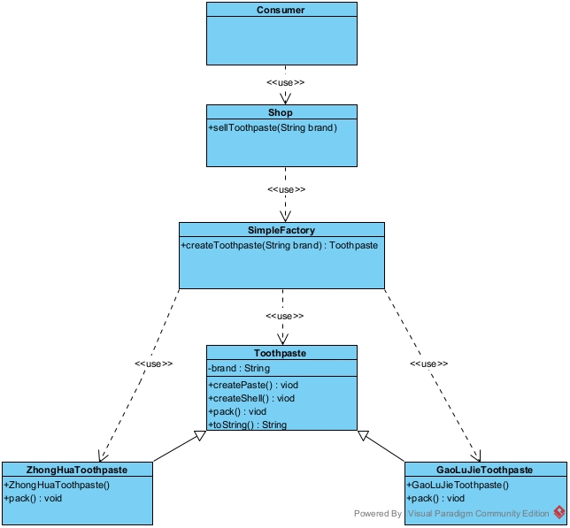

消费者Consumer类：

```java
/**
 * 购买牙膏的消费者
 */
public class Consumer {

    public static void main(String[] args) {
        Shop shop = new Shop();
        Toothpaste boughtToothpaste1 = shop.sellToothpaste("中华牌");
        System.out.println("消费者买到了" + boughtToothpaste1);
        System.out.println("================");
        Toothpaste boughtToothpaste2 = shop.sellToothpaste("高露洁牌");
        System.out.println("消费者买到了" + boughtToothpaste2);
    }
}
```


商店Shop类：

```java
/**
 * 商店类用于用户消费者购买牙膏
 */
public class Shop {

    /**
     * 卖牙膏方法
     *
     * @param brand 牙膏品牌
     * @return 牙膏对象
     */
    public Toothpaste sellToothpaste(String brand) {
        return SimpleFactory.createToothpaste(brand);
    }
}
```


简单工厂SimpleFactory类:

```java
/**
 * 用于生产牙膏的简单工厂
 */
public class SimpleFactory {

    /**
     * 创建牙膏方法
     */
    public static Toothpaste createToothpaste(String brand) {
        Toothpaste toothpaste = null;
        if ("中华牌".equals(brand)) {
            toothpaste = new ZhongHuaToothpaste();
        } else if ("高露洁牌".equals(brand)) {
            toothpaste = new GaoLuJieToothpaste();
        }
        if (toothpaste != null) {
            toothpaste.createPaste();
            toothpaste.createShell();
            toothpaste.pack();
        }
        return toothpaste;
    }
}
```


牙膏抽象Toothpaste类：

```java
/**
 * 牙膏抽象类
 */
public abstract class Toothpaste {

    protected String brand;

    public void createPaste() {
        System.out.println("产生了" + brand + "的膏体");
    }

    public void createShell() {
        System.out.println("产生了" + brand + "的外壳");
    }

    public abstract void pack();

    @Override
    public String toString() {
        return brand + "的牙膏";
    }
}
```


高露洁牙膏GaoLuJieToothpaste实现类：

```java
/**
 * 高露洁牌牙膏
 */
public class GaoLuJieToothpaste extends Toothpaste {

    public GaoLuJieToothpaste() {
        this.brand = "高露洁牌";
    }

    @Override
    public void pack() {
        System.out.println("给" + brand + "牙膏进行了包装！");
    }
}
```


中华牙膏ZhongHuaToothpaste实现类：

```java
/**
 * 中华牌牙膏
 */
public class ZhongHuaToothpaste extends Toothpaste {

    public ZhongHuaToothpaste() {
        this.brand = "中华牌";
    }

    @Override
    public void pack() {
        System.out.println("给" + brand + "牙膏进行了包装！");
    }
}
```

总结：

1.简单工厂将使用方和被使用方进行解耦，提高了软件的可扩展性、可维护性和可复用性。

2.但是还是违背了开闭原则（OCP原则），如果后续要扩展新的功能，需要修改简单工厂的工厂类对象中创建对象的代码。

3.使用场景：简单工厂模式适用于具体类十分确定且固定的一类产品的创建，这样才能不太频繁的修改简单工程类去实现扩展。


### 3.2.2工厂方法模式

将简单工厂中得到对象的方法写成一个抽象方法，也就是说在工厂类或者接口中不知道如何创建该对象，具体如何创建交给子类或者实现类去决定

案例：

UML类图：

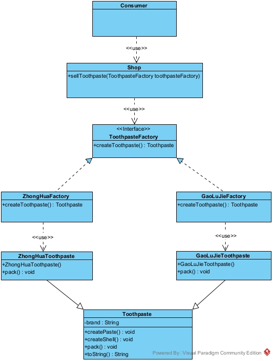


消费者Consumer类：

```java
/**
 * 购买牙膏的消费者
 */
public class Consumer {

    public static void main(String[] args) {
        Shop shop = new Shop();
        Toothpaste boughtToothpaste1 = shop.sellToothpaste(new ZhongHuaFactory());
        System.out.println("消费者买到了" + boughtToothpaste1);
        System.out.println("================");
        Toothpaste boughtToothpaste2 = shop.sellToothpaste(new GaoLuJieFactory());
        System.out.println("消费者买到了" + boughtToothpaste2);
    }
}
```


商店Shop类：

```java
/**
 * 商店类用于用户消费者购买牙膏
 */
public class Shop {

    /**
     * 卖牙膏方法
     * @param toothpasteFactory  牙膏品牌工厂
     * @return  牙膏对象
     */
    public Toothpaste sellToothpaste(ToothpasteFactory toothpasteFactory) {

        return toothpasteFactory.createToothpaste();
    }
}
```


牙膏工厂ToothpasteFactory接口类：

```java
/**
 * 用于生产牙膏的工厂
 * 将简单工厂模式中的工厂类换成一个抽象类或者接口
 * 并提供一个用户创建对象的抽象方法，也就是将创建对象
 * 的过程下沉到实现类或者子类去实现。
 */
public interface ToothpasteFactory {

    /**
     * 创建牙膏方法（这个方法就是工厂方法）
     * @return
     */
    Toothpaste createToothpaste();
}
```


中华牙膏工厂ZhongHuaFactory类：

```java
/**
 * 中华牌工厂类
 */
public class ZhongHuaFactory implements ToothpasteFactory {

    @Override
    public Toothpaste createToothpaste() {
        Toothpaste toothpaste = new ZhongHuaToothpaste();
        toothpaste.createPaste();
        toothpaste.createShell();
        toothpaste.pack();
        return toothpaste;
    }
}
```


高露洁牙膏工厂GaoLuJieFactory类：

```java
/**
 * 高露洁牌工厂类
 */
public class GaoLuJieFactory implements ToothpasteFactory{

    @Override
    public Toothpaste createToothpaste() {
        Toothpaste toothpaste = new GaoLuJieToothpaste();
        toothpaste.createPaste();
        toothpaste.createShell();
        toothpaste.pack();
        return toothpaste;
    }
}
```


牙膏Toothpaste抽象类：

```java
/**
 * 牙膏抽象类
 */
public abstract class Toothpaste {

    protected String brand;

    public void createPaste() {
        System.out.println("产生了" + brand + "的膏体");
    }

    public void createShell() {
        System.out.println("产生了" + brand + "的外壳");
    }

    public abstract void pack();

    @Override
    public String toString() {
        return brand + "的牙膏";
    }
}
```


高露洁牙膏GaoLuJieToothpaste类：

```java
/**
 * 高露洁牌牙膏
 */
public class GaoLuJieToothpaste extends Toothpaste {

    public GaoLuJieToothpaste() {
        this.brand = "高露洁牌";
    }

    @Override
    public void pack() {
        System.out.println("给" + brand + "牙膏进行了包装！");
    }
}
```


中华牙膏ZhongHuaToothpaste类：

```java
/**
 * 中华牌牙膏
 */
public class ZhongHuaToothpaste extends Toothpaste {

    public ZhongHuaToothpaste() {
        this.brand = "中华牌";
    }

    @Override
    public void pack() {
        System.out.println("给" + brand + "牙膏进行了包装！");
    }
}
```

总结：

1.将简单工厂中得到对象的方法写成一个抽象方法，其具体的类提供不同的工厂类来继承，实现类各自实现自己的工厂父类，这样遵循了开闭原则，我们只需要对其进行扩展，不需要修改任何原有类代码。

2.但这种方式会随着子工厂类和其实现类的增多而增加类的复杂度。

3.推荐使用这种方式。


### 3.2.3抽象工厂模式

提供一个创建一系列相关或者相互依赖的对象的工厂接口，而无需指定它们具体的类。其作用是产生一个产品系列或者是产品簇。

UML类图：

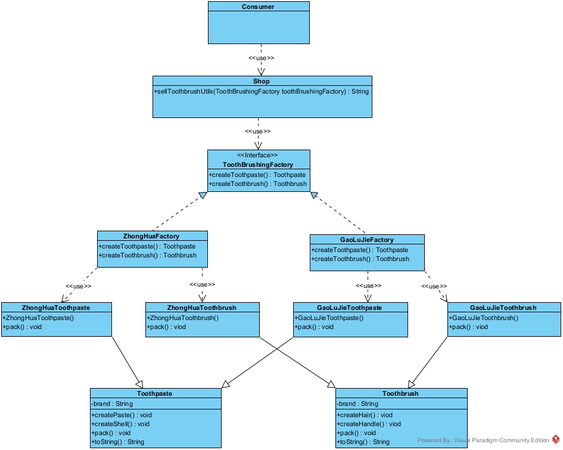


消费者Consumer类：

```java
/**
 * 购买刷牙工具的消费者
 */
public class Consumer {

    public static void main(String[] args) {
        Shop shop = new Shop();
        String boughtToothbrushingUtil = shop.sellToothbrushUtils(new ZhongHuaFactory());
        System.out.println("消费者买到了" + boughtToothbrushingUtil);
        System.out.println("================");
        String boughtToothbrushingUtil2 = shop.sellToothbrushUtils(new GaoLuJieFactory());
        System.out.println("消费者买到了" + boughtToothbrushingUtil2);
    }
}
```


商店Shop类：

```java
/**
 * 商店类用于用户消费者购买牙膏
 */
public class Shop {

    /**
     * 卖刷牙工具方法
     *
     * @param toothBrushingFactory 刷牙工具的品牌工厂
     * @return 刷牙工具对象
     */
    public String sellToothbrushUtils(ToothBrushingFactory toothBrushingFactory) {
        Toothpaste toothpaste = toothBrushingFactory.createToothpaste();
        Toothbrush toothbrush = toothBrushingFactory.createToothbrush();

        return toothpaste + "和" + toothbrush;
    }
}
```


工厂接口ToothBrushingFactory：

```java
/**
 * 用于生产刷牙工具的工厂
 * 工厂方法模式产生的产品都是一个类或接口的子类实例，
 * 抽象工厂模式产生的产品是多个接口或抽象类的子类实例。
 */
public interface ToothBrushingFactory {

    /**
     * 创建牙膏方法
     *
     * @return
     */
    Toothpaste createToothpaste();

    /**
     * 创建牙刷方法
     *
     * @return
     */
    Toothbrush createToothbrush();
}
```


中华牌工厂ZhongHuaFactory类：

 ```java
 /**
  * 中华牌工厂类
  */
 public class ZhongHuaFactory implements ToothBrushingFactory {
 
     @Override
     public Toothpaste createToothpaste() {
         Toothpaste toothpaste = new ZhongHuaToothpaste();
         toothpaste.createPaste();
         toothpaste.createShell();
         toothpaste.pack();
         return toothpaste;
     }
 
     @Override
     public Toothbrush createToothbrush() {
         Toothbrush toothbrush = new ZhongHuaToothbrush();
         toothbrush.createHandle();
         toothbrush.createHair();
         toothbrush.pack();
         return toothbrush;
     }
 }
 ```


高露洁牌工厂类

```java
/**
 * 高露洁工厂类
 */
public class GaoLuJieFactory implements ToothBrushingFactory {

    @Override
    public Toothpaste createToothpaste() {
        Toothpaste toothpaste = new GaoLuJieToothpaste();
        toothpaste.createPaste();
        toothpaste.createShell();
        toothpaste.pack();
        return toothpaste;
    }

    @Override
    public Toothbrush createToothbrush() {
        Toothbrush toothbrush = new GaoLuJieToothbrush();
        toothbrush.createHandle();
        toothbrush.createHair();
        toothbrush.pack();
        return toothbrush;
    }
}
```


牙刷Toothbrush抽象类：

```java
/**
 * 牙刷抽象类
 */
public abstract class Toothbrush {

    protected String brand;

    public void createHair() {
        System.out.println("产生了" + brand + "的牙刷毛");
    }

    public void createHandle() {
        System.out.println("产生了" + brand + "的手柄");
    }

    public abstract void pack();

    @Override
    public String toString() {
        return brand + "的牙刷";
    }
}
```


中华牌牙刷ZhongHuaToothbrush类：

```java
/**
 * 中华牌牙刷
 */
public class ZhongHuaToothbrush extends Toothbrush {

    public ZhongHuaToothbrush() {
        this.brand = "中华牌";
    }

    @Override
    public void pack() {
        System.out.println("给" + brand + "牙刷进行了组装！");
    }
}
```


高露洁牌牙刷GaoLuJieToothbrush类：

```java
/**
 * 高露洁牌牙刷
 */
public class GaoLuJieToothbrush extends Toothbrush {

    public GaoLuJieToothbrush() {
        this.brand = "高露洁牌";
    }

    @Override
    public void pack() {
        System.out.println("给" + brand + "牙刷进行了组装！");
    }
}
```


牙膏Toothpaste抽象类：

```java
/**
 * 牙膏抽象类
 */
public abstract class Toothpaste {

    protected String brand;

    public void createPaste() {
        System.out.println("产生了" + brand + "的膏体");
    }

    public void createShell() {
        System.out.println("产生了" + brand + "的外壳");
    }

    public abstract void pack();

    @Override
    public String toString() {
        return brand + "的牙膏";
    }
}
```


中华牌牙膏ZhongHuaToothpaste类：

```java
/**
 * 中华牌牙膏
 */
public class ZhongHuaToothpaste extends Toothpaste {

    public ZhongHuaToothpaste() {
        this.brand = "中华牌";
    }

    @Override
    public void pack() {
        System.out.println("给" + brand + "牙膏进行了包装！");
    }
}
```


高露洁牌牙膏GaoLuJieToothpaste类：

```java
/**
 * 高露洁牌牙膏
 */
public class GaoLuJieToothpaste extends Toothpaste {

    public GaoLuJieToothpaste() {
        this.brand = "高露洁牌";
    }

    @Override
    public void pack() {
        System.out.println("给" + brand + "牙膏进行了包装！");
    }
}
```

总结：

1.工厂方法模式产生的产品都是一个类或接口的子类实例，抽象工厂模式产生的产品是多个接口或抽象类的子类实例。

2.这种方式其实也可以单独的把它看做一个设计模式（包含在23种设计模式之中）。

3.当关心的是一个产品簇对象的创建时，推荐使用此方式。


## 3.3建造者模式

建造者模式也叫生成器模式，是一种用于构建对象的模式。它可以将复杂对象的构建过程抽象出来成为一个抽象类或者接口，使这个抽象的过程的不同实现方法可以构造出不同表现（具有不同属性）的子类或者这实现类对象。建造者模式是一步一步创建一个复杂的对象，它允许用户只通过指定复杂对象的类型和内容就可以构建它们，用户不需要知道内部的具体构建细节是怎么实现的。


建造者模式包含的四种角色：
Product（产品角色）：一个具体的产品对象。
Builder（抽象建造者）：一个可以创建Product对象的各个零件的接口或者抽象类。
ConcreteBuilder（具体建造者）：Builder的实现类或者子类，用于具体细节地去创建Product对象的各个零件。
Director（指挥者）：内部会构建一个Builder实现类或者子类的对象，用于创建一个复杂的对象；作用其一是将用户与产品生产的过程进行了隔离，其二是可以控制产品的生产过程。


注意事项：
建造者模式是用于创建复杂的对象且这个复杂的对象的加工有一定顺序要求的。也就是说这个对象的创建是由多个零件组成的且在创建过程中组装每个零件的都是有步骤要求的。


案例：

1.以汽车生产为例：生产和组装汽车需要的工序是：生产发动机、生产汽车外壳、将发动机组装到外壳中、生产轮胎、将轮胎组装到汽车外壳中。

2.生产汽车的过程虽然都是一样的，但是不同配置等级的汽车对每个零件的要求是不同的。

以下案例中CarDirector类就是指挥者角色，CarBuilder类就是抽象建造者角色，StandardCarBuilder类和HighCollocationCarBuilder类就是具体的建造者角色，Car类就是具体的产品角色。


UML类图：

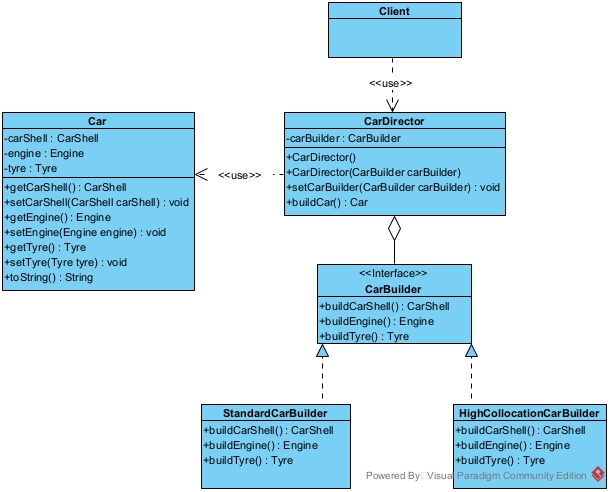


客户端Client类：

```java
/**
 * 使用建造者模式实现的建造汽车客户端
 * 用建造者模式：将产品和产品的生产过程解耦，也就是拆分开，进行实现
 */
public class Client {

    public static void main(String[] args) {
        //生产标配汽车
        CarDirector carDirector = new CarDirector(new StandardCarBuilder());
        Car standardCar = carDirector.buildCar();
        System.out.println("得到的汽车是：" + standardCar);

        //生产高配汽车
        carDirector.setCarBuilder(new HighCollocationCarBuilder());
        Car highCollocationCar = carDirector.buildCar();
        System.out.println("得到的汽车是：" + highCollocationCar);
    }
}
```


汽车建造者指挥者CarDirector类：

```java
/**
 * 汽车建造指挥者
 */
public class CarDirector {

    private CarBuilder carBuilder = null;

    public CarDirector() {

    }

    //构造器注入
    public CarDirector(CarBuilder carBuilder) {
        this.carBuilder = carBuilder;
    }

    //set方法注入
    public void setCarBuilder(CarBuilder carBuilder) {
        this.carBuilder = carBuilder;
    }

    /**
     * 将汽车的组装过程交给指挥者来控制
     */
    public Car buildCar() {
        Engine engine = carBuilder.buildEngine();
        CarShell carShell = carBuilder.buildCarShell();
        System.out.println("将" + engine + "组装到" + carShell + "中");
        Tyre tyre = carBuilder.buildTyre();
        System.out.println("将" + tyre + "组装到" + carShell + "中");
        Car car = new Car();
        car.setEngine(engine);
        car.setCarShell(carShell);
        car.setTyre(tyre);
        return car;
    }
}
```


汽车建造者CarBuilder接口类：

```java
/**
 * 汽车建造者接口
 */
public interface CarBuilder {
    //生产外壳
    CarShell buildCarShell();
    //生产发动机
    Engine buildEngine();
    //生产轮胎
    Tyre buildTyre();
}
```


标配汽车建造者StandardCarBuilder类：

```java
/**
 * 标配汽车建造者
 */
public class StandardCarBuilder implements CarBuilder {

    /**
     * 建造汽车外壳
     */
    @Override
    public CarShell buildCarShell() {
        return new CarShell("标配汽车外壳");
    }

    /**
     * 建造发动机
     */
    @Override
    public Engine buildEngine() {
        return new Engine("标配汽车发动机");
    }

    /**
     * 建造轮胎
     */
    @Override
    public Tyre buildTyre() {
        return new Tyre("标配汽车轮胎");
    }
}
```


高配汽车建造者HighCollocationCarBuilder类：

```java
/**
 * 高配汽车建造者
 */
public class HighCollocationCarBuilder implements CarBuilder {

    /**
     * 建造汽车外壳
     */
    @Override
    public CarShell buildCarShell() {
        System.out.println("给高配汽车的外壳添加优质的钢材");
        return new CarShell("高配汽车外壳");
    }

    /**
     * 建造发动机
     */
    @Override
    public Engine buildEngine() {
        return new Engine("高配汽车发动机");
    }

    /**
     * 建造轮胎
     */
    @Override
    public Tyre buildTyre() {
        return new Tyre("高配汽车轮胎");
    }
}
```


汽车外壳CarShell类：

```java
/**
 * 汽车外壳类
 */
public class CarShell {

    private String name;

    public CarShell(String name) {
        this.name = name;
    }

    @Override
    public String toString() {
        return name;
    }
}
```


汽车发动机Engine类：

```java
/**
 * 发动机类
 */
public class Engine {

    private String name;

    public Engine(String name) {
        this.name = name;
    }

    @Override
    public String toString() {
        return name;
    }
}
```


汽车轮胎Tyre类：

```java
/**
 * 轮胎类
 */
public class Tyre {

    private String name;

    public Tyre(String name) {
        this.name = name;
    }

    @Override
    public String toString() {
        return name;
    }
}
```


汽车Car类：

```java
/**
 * 汽车
 */
public class Car {

    //汽车外壳
    private CarShell carShell;

    //汽车发动机
    private Engine engine;

    //汽车轮胎
    private Tyre tyre;

    public CarShell getCarShell() {
        return carShell;
    }

    public void setCarShell(CarShell carShell) {
        this.carShell = carShell;
    }

    public Engine getEngine() {
        return engine;
    }

    public void setEngine(Engine engine) {
        this.engine = engine;
    }

    public Tyre getTyre() {
        return tyre;
    }

    public void setTyre(Tyre tyre) {
        this.tyre = tyre;
    }

    @Override
    public String toString() {
        return "Car：" + carShell + "+" + engine + "+" + tyre;
    }

}
```

总结：
1.客户端（使用方）不必知道产品内部的组成细节，将产品与产品的创建过程解耦，使得相同的创建过程可以创建不同的产品。
2.每一个具体的建造者都相对独立，而与其它的建造者都无关，因此可以很方便的替换具体的建造者或增加具体新的建造者，用户使用不同的建造者即可获得不同的产品以上两点遵守了单一职能原则。
3.可以更加精细地去控制产品的创建过程，将复杂产品的创建步骤分解在不同的方法中，使得创建过程更加清晰，也更方便在代码中去控制创建过程，具有很好的可读性。
4.增加具体的建造者无需修改原有的产品类代码，指挥者类是面向抽象的建造者编程，所以具有很好的可扩展性，遵守了开闭原则和依赖倒置原则。
5.是使用的聚合的方式代替继承，所以遵守了合成复用原则。
6.建造者模式所创建的产品一般具有较多的共同特点，其组成部分相似，具有相似的组装步骤，如果产品之间的差异性很大，则不适合使用建造者模式。
7.如果产品的内部变化复杂，可能会导致定义多个具体的建造者去实现变化，导致系统变得很庞大，类的复杂度大大增加，这种情况也不适用建造者模式。（如果说建造者类超过5个，那么就要考虑不使用建造者模式了）
8.建造者模式和工厂模式的区别：
工厂模式注重的是整体对象的创建方法，而建造者模式注重的是对象的创建过程，创建对象的过程方法可以在创建时自由调用。使用工厂模式是不关心产品的构建过程的，只关心什么类型的产品由什么类型的工厂去创建，而建造者模式是要求按照指定的工序去建造产品，它的主要目的是通过组装不同的零件而产生一个新的产品。


## 3.4原型模式

原型模式指的是用一个已经创建的实例作为原型，通过复制该原型对象来创建一个和原型相同或相似的新对象。在这里，原型实例指定了要创建的对象的种类。用这种方式创建对象非常高效，根本无须知道对象创建的细节。例如，虚拟机CentOS操作系统的安装通常较耗时，如果克隆就快了很多。


进一步阐述：

原型模式的克隆分为浅克隆和深克隆。

浅克隆：创建一个新对象，新对象的属性和原来对象完全相同，对于非基本类型属性，仍指向原有属性所指向的对象的内存地址。

深克隆：创建一个新对象，属性中引用的其他对象也会被克隆，不再指向原有对象地址。


原型模式包含的三种角色：

AbstractPrototype（抽象原型角色）：规定了具体原型对象必须实现的接口。

ConcretePrototype（具体原型角色）：实现抽象原型类的 clone() 方法，它是可被复制的对象。

Visit（访问角色）：使用具体原型类中的 clone() 方法来复制新的对象。


案例：用原型模式生成“三好学生”奖状为例，同一学校的“三好学生”奖状除了获奖人姓名不同，其他都相同，属于相似对象的复制，然后再做简单修改就可以了。客户端Client类就是具体的访问角色，奖状Citation类，就是具体原型角色，JDK提供的Cloneable接口就是抽象原型角色。


UML类图：

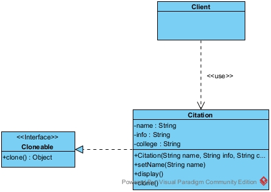


客户端Client类：

```java
/**
 * 使用原型模式的客户端（访问角色）
 */
public class Client {

    public static void main(String[] args) throws CloneNotSupportedException {
        //创建奖状原型
        Citation citation = new Citation("xx", "同学：在2021学年第一学期中表现优秀，被评为三好学生。", "成都学院");

        //克隆奖状，并写上每个同学的姓名
        Citation zhangSanCitation= (Citation) citation.clone();
        zhangSanCitation.setName("张三");
        zhangSanCitation.display();

        Citation liSiCitation= (Citation) citation.clone();
        liSiCitation.setName("李四");
        liSiCitation.display();
    }
}
```


奖状Citation类：

```java
/**
 * 奖状类（具体原型角色）
 * 其中JDK提供的Cloneable接口就是抽象原型角色
 */
public class Citation implements Cloneable {
    /**
     * 获奖学生名字
     */
    String name;

    /**
     * 获奖信息
     */
    String info;

    /**
     * 学院
     */
    String college;

    public Citation(String name, String info, String college) {
        this.name = name;
        this.info = info;
        this.college = college;
        System.out.println("奖状创建成功！");
    }

    /**
     * 设置不同学生的奖状名字
     */
    public void setName(String name) {
        this.name = name;
    }

    /**
     * 陈列奖状信息的方法
     */
    public void display() {
        System.out.println(name + info + college);
    }

    /**
     * 重写克隆方法
     */
    @Override
    public Object clone() throws CloneNotSupportedException {
        System.out.println("奖状拷贝成功！");
        return super.clone();
    }
}
```

总结：

1.Java自带的原型模式基于内存二进制流的复制，在性能上比直接 new 一个对象更加优良。

2.可以使用深克隆方式保存对象的状态，使用原型模式将对象复制一份，并将其状态保存起来，简化了创建对象的过程，以便在需要的时候使用（例如恢复到历史某一状态），可辅助实现撤销操作。

3.需要为每一个类都配置一个 clone 方法，clone 方法位于类的内部，当对已有类进行改造的时候，需要修改代码，违背了开闭原则。

4.当实现深克隆时，需要编写较为复杂的代码，而且当对象之间存在多重嵌套引用时，为了实现深克隆，每一层对象对应的类都必须支持深克隆，实现起来会比较麻烦。因此，深克隆、浅克隆需要运用得当。


典型运用场景举例：

对象之间相同或相似，即只是个别的几个属性不同的时候。

系统中大量使用该类对象，且各个调用者都需要给它的属性重新赋值。

在 Spring 中，原型模式应用的非常广泛，例如 @scope("prototype")改为多例模式的时候，其实对象是基于原型模式克隆出来的多个对象，并非是New出来和反射出来的。


# 4.结构型设计模式

结构型设计模式：从类与类之间的结构的角度去降低耦合度的思考而产生的的类型。


## 4.1适配器模式

适配器模式(Adapter Pattern)将某个类的接口转换成客户端期望的另一个接口表示， 主要的目的是兼容性，让原本因接口不匹配不能一起工作的两个类可以协同工作，其别名为包装器(Wrapper)；适配器模式属于结构型模式；主要分为三类：类适配器模式、对象适配器模式、接口适配器模式。


进一步阐述：
1）适配器模式：将一个类的接口转换成另一种接口让原本接口不兼容的类可以相互兼容使用；
2）从用户的角度看不到被适配者的，因为适配器做了被适配者和使用者的解耦；
3）用户调用适配器转化出来的目标接口的方法，适配器再调用被适配者的相关接口方法；
4）用户收到反馈结果，感觉只是和目标接口交互，没有感觉到有适配器的存在。


适配器模式包含三种角色：
Target（目标接口）：客户端所需要的接口，可以是接口或抽象类，也可以是实体类。
Adaptee（需要适配的类）：被适配者，也就是想要新加入使得目标接口可用的类。
Adapter（适配器）：把原接口转化成目标接口的类。


案例：我们以电脑通过USB接口接入各种设备为例，USB接口类就是目标接口，ApplePhone就是需要适配的类，USBAdapter类就是适配器。

Computer电脑类：

```java
/**
 * 电脑类（相当于使用方即客户端）
 * 只有USB接口
 */
public class Computer {

    /**
     * 使用某USB设备方法
     */
    public String useElectronicEquipment(USB usb) {
        return usb.provideUsbSomething();
    }

    public static void main(String[] args) {
        //创建电脑使用电脑的功能
        Computer computer = new Computer();
        //使用移动硬盘
        System.out.println(computer.useElectronicEquipment(new MobileHardDisk()));
    }
}
```


USB接口类：

```java
/**
 * USB接口（相当于提供方及目标接口）
 */
public interface USB {

    /**
     * 提供相关功能方法
     */
    String provideUsbSomething();
}
```


移动硬盘MobileHardDisk类：

```java
/**
 * 移动硬盘
 */
public class MobileHardDisk implements USB {

    @Override
    public String provideUsbSomething() {
        return "提供移动硬盘的功能";
    }
}
```

由上可以看到，如果我们需要接入其他设配只需要接入的设备去实现USB接口，在原有Computer类中进行创建和使用即可，但是假如现在我有一个苹果手机，但该手机并不能直接接入USB接口，在生活中我们是通过转接头等方式来进行接入，那么类适配器模式就等于是这个转接头。


1）类适配器模式


UML类图：

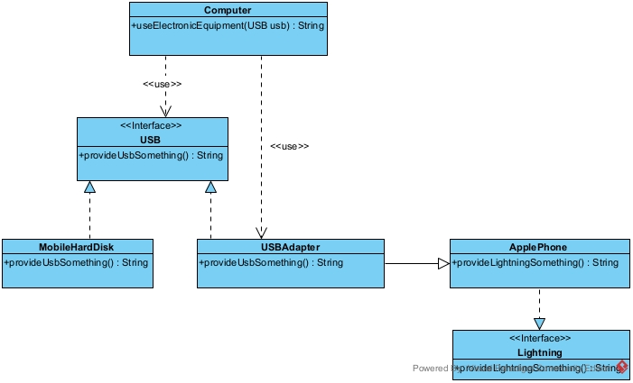

苹果手机Lightning接口：

```java
/**
 * 苹果手机充电接口
 */
public interface Lightning {

    /**
     * 提供苹果手机相关功能方法
     */
    String provideLightningSomething();

}
```


苹果手机ApplePhone实现类：

```java
/**
 * 苹果手机（相当于需要适配的类即Adaptee）
 */
public class ApplePhone implements Lightning {

    @Override
    public String provideLightningSomething() {
        return "提供苹果手机相关功能";
    }
}
```


USB适配器USBAdapter类：

```java
/**
 * USB接口适配器（相当于一个多功能USB转接头即Adapter）
 * 这种使用继承的方式就是类适配器模式
 */
public class USBAdapter extends ApplePhone implements USB{

    @Override
    public String provideUsbSomething() {
        return provideLightningSomething();
    }
}
```


电脑类Computer类改造使用：

```java
/**
 * 电脑类（相当于使用方即客户端）
 * 只有USB接口
 */
public class Computer {

    /**
     * 使用某USB设备方法
     */
    public String useElectronicEquipment(USB usb) {
        return usb.provideUsbSomething();
    }

    public static void main(String[] args) {
        //创建电脑使用电脑的功能
        Computer computer = new Computer();
        //使用移动硬盘
        System.out.println(computer.useElectronicEquipment(new MobileHardDisk()));
        //使用苹果手机
        System.out.println(computer.useElectronicEquipment(new USBAdapter()));
    }
}
```

以上就是一个类适配器的简单案例，但是有一些缺陷：

1.Java 是单继承机制，所以类适配器需要继承 ApplePhone 类这一点算是一个缺点,因为这要求 USB 必须是接口，有一定局限性;

2.ApplePhone 类的方法在 Adapter 中都会暴露出来，也增加了使用的成本。

3.由于其继承了 ApplePhone 类，所以它可以根据需求重写 ApplePhone 类的方法，使得 Adapter 的灵活性增强了。但是ApplePhone是一个实体类，如果重写其已经实现的方法那么就会违反里式替换原则。


2）对象适配器模式


UML类图：

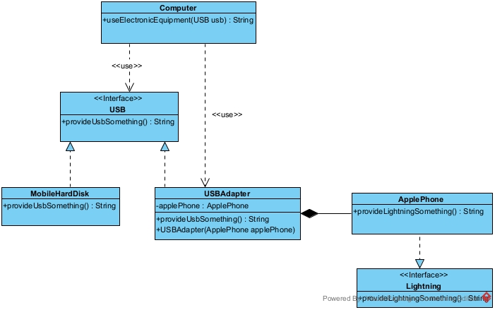

苹果手机Lightning接口：

```java
/**
 * 苹果手机充电接口
 */
public interface Lightning {

    /**
     * 提供苹果手机相关功能方法
     */
    String provideLightningSomething();

}
```


苹果手机ApplePhone实现类：

```java
/**
 * 苹果手机（相当于需要适配的类即Adaptee）
 */
public class ApplePhone implements Lightning {

    @Override
    public String provideLightningSomething() {
        return "提供苹果手机相关功能";
    }
}
```


USB适配器USBAdapter类：

```java
/**
 * USB接口适配器（相当于一个多功能USB转接线）
 * 这种使用组合的方式就是对象适配器模式
 */
public class USBAdapter1 implements USB {

    private ApplePhone applePhone;

    public USBAdapter1(ApplePhone applePhone) {
        this.applePhone = applePhone;
    }

    @Override
    public String provideUsbSomething() {
        return applePhone.provideLightningSomething();
    }
}
```


电脑类Computer类改造使用：

```java
/**
 * 电脑类（相当于使用方即客户端）
 * 只有USB接口
 */
public class Computer {

    /**
     * 使用某USB设备方法
     */
    public String useElectronicEquipment(USB usb) {
        return usb.provideUsbSomething();
    }

    public static void main(String[] args) {
        //创建电脑使用电脑的功能
        Computer computer = new Computer();
        //使用移动硬盘
        System.out.println(computer.useElectronicEquipment(new MobileHardDisk()));
        //使用苹果手机
        System.out.println(computer.useElectronicEquipment(new USBAdapter()));
        //使用苹果手机（对象适配器）
        System.out.println(computer.useElectronicEquipment(new USBAdapter1(new ApplePhone())));
    }
}
```

以上就是一个对象适配器的简单案例，它有如下的优点：

1.基本思路和类的适配器模式相同，只是将 Adapter 类做修改，不是继承 ApplePhone 类，而是持有 ApplePhone 类的实例，以解决兼容性的问题。 即：持有 ApplePhone 类，实现 USB 接口，完成 ApplePhone到USB 的适配。

2.根据“ 合成复用原则”，在系统中尽量使用 关联关系（组合）来替代继承关系。

3.对象适配器模式是适配器模式运用最多的一种。


3）接口适配器模式：

接口适配器模式就是说一个接口含有多个抽象方法，我们通过一个抽象类来实现其具体的接口，实际在使用时可以根据要使用的方法来进行适配，这种方式的好处是在于，如果我们采用一个类直接去实现一个接口，那么需要覆盖所有的抽象方法，但可能在使用方使用时关心的是某一个方法，所以我们以抽象类的方式呈现的这种方式可以不需要我们去覆盖不关注的方法。

```java
/**
 * 接口适配器模式，也叫缺省适配器模式
 */
public class InterfaceAdapter {

    public static void main(String[] args) {
        //在某处需要使用到TestInterface的实现类
        test(new AbsClass() {
            @Override
            public void testMethod3() {
                super.testMethod3();
            }
        });
    }


    public static void test(TestInterface ti) {
        ti.testMethod3();
    }

}

//Target接口
interface TestInterface {

    void testMethod1();

    void testMethod2();

    void testMethod3();

    void testMethod4();

    void testMethod5();
}

//适配器角色
abstract class AbsClass implements TestInterface {

    @Override
    public void testMethod1() {

    }

    @Override
    public void testMethod2() {

    }

    @Override
    public void testMethod3() {

    }

    @Override
    public void testMethod4() {

    }

    @Override
    public void testMethod5() {

    }
}
```

**值得注意的是：在Java8之后由于加入了default关键字，允许接口中出现默认方法，其实有点可以把它看做是接口适配器模式的一种简化**

## 4.2装饰者模式

装饰者模式可以实现动态（在编译期是固定的，但是在运行期是随着java程序运行的不同而变化的）地为一个对象增加新的功能；是使用组合或者聚合的形式代替继承的方式进行扩展新的功能（即扩展新的功能无需通过继承的方式增加子类）这样就使整个功能模块更加灵活，很好的避免了新增功能使得类快速增多从而使整个软件类复杂度极高的情况。


进一步阐述：装饰者模式就像一个牙膏的生产过程，有主体和外包装，主体可以单独存在并成为一个产品，主体也可以加上外包装使之成为一个新的主体也是一个产品。


装饰者模式包含四种角色：
Component（抽象的主体角色）： 是一个具体的主体对象和装饰者对象都要实现的接口或者继承的抽象类。这样，客户端就能够像调用具体的主体对象相同的方式去调用装饰者对象完成功能。
ConcreteComponent（具体的主体即被装饰者角色）：就是一个用于被装饰的实体，也可以单独调用。
Decorator（抽象装饰者角色）：一般为一个抽象类，也可以是实体类，它持有一个抽象主体的引用，并接收所有客户端的请求，并把这些请求转发给具体的被装饰者对象去处理，这样就能在具体被装饰者调用前后增加新的功能。
ConcreteDecorator（具体装饰者角色）：负责给被装饰者扩展新的功能。


案例：

以吃一碗面为例，用户可以根据自己的喜好选择不同类型面的搭配，这就是装饰者模式最好的体现。以下案例中Noodles面条类就是抽象的主题角色；BeefNoodles牛肉面类和HotDryNoodles热干面条类就是具体的被装饰者角色；Decorator类就是抽象装饰者角色；Egg鸡蛋类和HamSausage火腿肠类就是具体的装饰者角色。


UML类图：

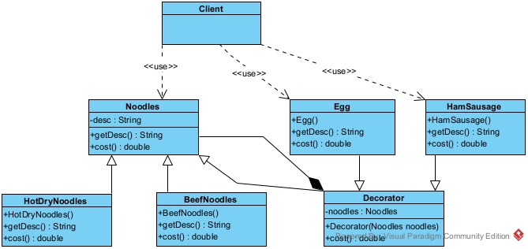


客户端Client类：

```java
/**
 * 使用装饰者模式
 */
public class Client {

    public static void main(String[] args) {
        //吃牛肉鸡蛋面
        Noodles noodles1 = new BeefNoodles();
        noodles1 = new Egg(noodles1);
        //点一份牛肉鸡蛋火腿肠面
        noodles1 = new HamSausage(noodles1);
        System.out.println("吃" + noodles1.getDesc() + "的价格是：" + noodles1.cost() + "元");

        //吃普通热干面
        Noodles noodles2 = new HotDryNoodles();
        System.out.println("吃" + noodles2.getDesc() + "的价格是：" + noodles2.cost() + "元");
    }
}
```


面条Noodles抽象类：

```java
/**
 * 面条抽象类（抽象的主体被装饰者）
 */
public abstract class Noodles {

    protected String desc;

    public String getDesc() {
        return desc;
    }

    /**
     * 计算面条价格方法（根据不同的配料计价所以是抽象方法）
     */
    public abstract double cost();
}
```


牛肉面条BeefNoodles类：

```java
/**
 * 牛肉面条类（具体的主体被装饰者）
 */
public class BeefNoodles extends Noodles {

    public BeefNoodles() {
        this.desc = "牛肉面";
    }

    public String getDesc() {
        return desc;
    }

    /**
     * 计算面条价格方法（根据不同的配料计价所以是抽象方法）
     */
    @Override
    public double cost() {
        //没有过多的if-- else  if的判断
        return 20.0;
    }
}
```


热干面HotDryNoodles类：

```java
/**
 * 热干面条类（具体的主体被装饰者）
 */
public class HotDryNoodles extends Noodles {

    public HotDryNoodles() {
        this.desc = "热干面";
    }

    public String getDesc() {
        return desc;
    }

    /**
     * 计算面条价格方法（根据不同的配料计价所以是抽象方法）
     */
    @Override
    public double cost() {
        return 15.0;
    }
}
```


抽象装饰者Decorator类：

```java
/**
 * 抽象装饰者类（抽象装饰者）
 */
public abstract class Decorator extends Noodles {

    /*
     * 持有一个抽象被装饰者的引用
     */
    protected Noodles noodles;

    public Decorator(Noodles noodles) {
        this.noodles = noodles;
        this.desc = noodles.getDesc();
    }

    /**
     * 计算面条价格方法（根据不同的配料计价所以是抽象方法）
     */
    public abstract double cost();
}
```


鸡蛋Egg类：

```java
/**
 * 鸡蛋类（具体装饰者类）
 */
public class Egg extends Decorator {

    public Egg(Noodles noodles) {
        super(noodles);
        this.desc += "鸡蛋";
    }

    public String getDesc() {
        return desc;
    }

    /**
     * 计算价格方法
     */
    public double cost() {
        return noodles.cost() + 2.0;
    }
}
```


火腿肠HamSausage类：

```java
/**
 * 火腿肠类（具体装饰者类）
 */
public class HamSausage extends Decorator {

    public HamSausage(Noodles noodles) {
        super(noodles);
        this.desc += "火腿肠";
    }

    public String getDesc() {
        return desc;
    }

    /**
     * 计算价格方法
     */
    public double cost() {
        return noodles.cost() + 1.5;
    }
}
```

总结：
1.装饰者模式（Decorator）也叫包装器模式（Wrapper）它降低系统的耦合度，拥有可以动态的增加或删除对象的职责，并使得具体被装饰者类和具体装饰者类可以独立变化，以便扩展新的具体被装饰者类和具体装饰者类。
2.扩展对象功能，比继承灵活，不会导致类个数因为扩展而暴增的情况降低了类的复杂度。
3.可以对一个对象进行多次装饰，创造出不同行为的组合，得到功能更加强大的可使用对象，具体被装饰者类和具体装饰者类可以独立变化，用户可以根据需要自己增加新的具体被装饰者类和具体装饰者类，这样就具有了很好的可扩展性和可靠性，遵守了开闭原则（OCP原则）。
4.由于在扩展时是使用关联去实现扩展，所以遵守了合成复用原则。
5.装饰者模式和适配器模式的区别：
装饰者与适配器都有一个别名叫做包装模式(Wrapper)，它们看似都是起到包装一个类或对象的作用，但是使用它们的目的很不一样。适配器模式的意义是要将一个接口转变成另一个接口，它的目的是通过改变接口来达到重复使用的目的。而装饰者模式不是要改变被装饰者对象的接口，而是恰恰要保持原有的接口，但是增强原有对象的功能，或者改变原有对象的处理方式而提升性能。所以这两个模式设计的目的是不同的。
	1）关于新职责：适配器也可以在转换时增加新的职责，但主要目的不在此。装饰者模式主要是给被装饰者增加新职责的。
	2）关于原接口：适配器模式是用新接口来调用原接口，原接口对新系统是不可见或者说不可用的。装饰者模式原封不动的使用原接口，系统对装饰的对象也通过原接口来完成使用。（增加新接口的装饰者模式可以认为是其变种--“半透明”装饰者）。
	3）关于其包裹的对象：适配器是知道被适配者的详细情况的（就是哪个类或哪个接口）。装饰者只知道其接口是什么，至于其具体类型（是基类还是其他派生类）只有在运行期间才知道。


## 4.3门面模式

门面模式（Facade），也叫 “外观模式”：门面模式为子系统中的一组接口提供一个一致的门面（也就是软件的入口），此模式定义了一个高层接口，这个接口使得这一子系统更加容易使用。门面模式通过定义一个一致的接口，用以屏蔽内部子系统的细节，使得调用者只需跟这个接口发生调用，而无需关心这个子系统的内部细节。


门面模式包含三种角色：
Facade（门面类）：为调用者提供统一的调用接口, 门面类知道哪些子系统负责处理请求并完成相关的请求处理,从而将调用者的请求转交给适当子系统对象去完成处理；
Client （调用者）: 门面接口的调用者，也就是使用者；
SubSystemList（子系统的集合）也就是门面接口实现类中的成员变量：指模块或者子系统，去实际处理 Facade对象指派的任务，他是功能的实际提供者。


案例：我们以烹饪为例，从商品购买食材，到切菜烹饪整个过程演示门面模式。其中Cooker就是门面类，Client类就是调用者类，其他类都属于子系统的集合。


UML类图：

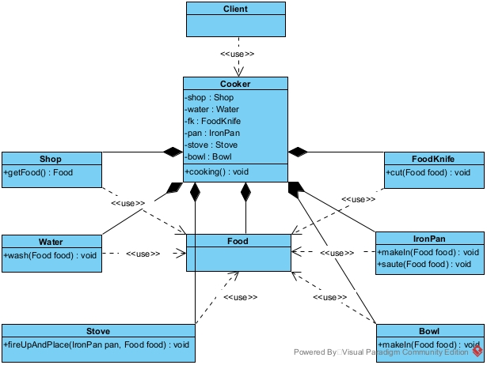


客户端Client类：

```java
/**
 * 这里客户端模拟人对象
 */
public class Client {

    public static void main(String[] args) {
        Cooker cooker = new Cooker();
        cooker.cooking();
        System.out.println("开始吃碗里做好的食物");
    }
}
```


厨师类Cooker类：

```java
/**
 * 模拟厨师对象
 */
public class Cooker {

    private Shop shop = new Shop();

    private Water water = new Water();

    private FoodKnife fk = new FoodKnife();

    private IronPan pan = new IronPan();

    private Stove stove = new Stove();

    private Bowl bowl = new Bowl();

    /**
     * 烹饪方法
     */
    public void cooking() {
        //从菜市场将食材买到
        Food food = shop.getFood();
        //对食材进行清洗
        water.wash(food);
        //将食材用菜刀进行切加工
        fk.cut(food);
        //将切好的食材放入铁锅中
        pan.makeIn(food);
        //将灶台点火并将装有食材的铁锅放上去进行煎炒
        stove.fireUpAndPlace(pan, food);
        //煎炒完毕放入碗中可以吃了
        bowl.makeIn(food);
    }
}
```


Shop商店类：

```java
/**
 * 商店类
 */
public class Shop {

    /**
     * 购买食材方法
     */
    public Food getFood() {
        System.out.println("从菜市场买到了食材");
        return new Food();
    }
}
```


食品Food类：

```java
/**
 * 食品类
 */
public class Food {
    
}
```


水Water类：

```java
/**
 * 水类
 */
public class Water {

    /**
     * 洗食材方法
     */
    public void wash(Food food) {
        System.out.println("对食材用水进行清洗。");
    }
}
```


菜刀FoodKnife类：

```java
/**
 * 菜刀类
 */
public class FoodKnife {

    /**
     * 切食材方法
     */
    public void cut(Food food) {
        System.out.println("用菜刀切食材，使之达到可以直接下锅的状态。");
    }
}
```


铁锅IronPan类：

```java
/**
 * 铁锅类
 */
public class IronPan {

    /**
     * 放入食材
     */
    public void makeIn(Food food) {
        System.out.println("将切好的食材放入铁锅中");
    }

    /**
     * 炒食材
     */
    public void saute(Food food) {
        System.out.println("对食材进行煎炒……");
    }
}
```


天然气灶Stove类：

```java
/**
 * 天然气灶类
 */
public class Stove {

    /**
     * 点火并放上铁锅方法
     */
    public void fireUpAndPlace(IronPan pan, Food food) {
        pan.saute(food);
    }
}
```


碗Bowl类：

```java
/**
 * 碗类
 */
public class Bowl {

    /**
     * 盛东西
     */
    public void makeIn(Food food) {
        System.out.println("将做好的食材盛入碗中……");
    }
}
```

总结：
1.门面模式对外屏蔽了子系统的细节，因此门面模式降低了客户端对子系统使用的复杂性； 
2.门面模式对客户端与子系统的直接耦合关系进行了解耦，让子系统内部的模块更易维护和扩展；
3.通过合理的使用门面模式，可以帮我们更好的划分访问的层次，形成较为合理的层次结构，特别是在分层模块化架构的时候，就应该使用门面模式；
4.在维护一个遗留的大型系统时，可能这个系统已经变得非常难以维护和扩展，此时可以考虑为新系统开发一个Facade 类，来提供遗留系统的比较清晰简单的接口，让新系统与 Facade类交互，提高代码的可复用性；
5.不能过多或者滥用门面模式，使用门面模式好，还是直接调用模块好。要以让系统有层次，利于维护为目的；
6.门面模式将具体实现细节和调用者去调控进行分离，使得调用者对其功能的内部细节实现方式不关心，就遵守了迪米特法则，调用者尽可能少的知道其要实现功能的者的内部实现细节。


## 4.4桥接模式

桥接模式将实现和抽象放在两个或两个以上不同的类层次中，使两个或两个以上层次可以独立改变；桥接模式属于结构型设计模式；桥接模式是基于类的最小设计原则，通过使用封装、聚合、组合和继承的方式让不同的类承担不同的职责，它的主要特点是将抽象和行为实现分离开来，从而可以保证各部分的独立性以及应对它们之后的扩展。


进一步阐述：是用于解决多重继承结构，多维度变化的场景，将各个维度设计成独立的继承结构，使各个维度可以独立的扩展在抽象层建立关联。


桥接模式包含四种角色：
Abstraction（抽象角色）： 抽象的定义，并保存一个Implementor对象的引用；
RefineAbstraction（扩展抽象角色）： 继承Abstraction并对其进行拓展；
Implementor（抽象实现角色）： 定义实现类的接口，提供基本操作，其具体的操作交给子类实现；
ConcreteImplementor（具体实现角色）： 实现Implementor接口，在程序运行时，子类对象将替换其父类对象，提供给Abstraction具体的业务操作方法。


案例：以家用电器和品牌桥接为例，其中电器类ElectricAppliance就是抽象角色，冰箱Refrigerator类和空调Conditioner类就是扩展抽象角色，品牌接口Brand就是抽象实现角色，海尔Haier类和格力Gree类就是具体实现角色。


UML类图：


客户端Client类：

```java
/**
 * 使用桥接模式的客户端
 */
public class Client {

    public static void main(String[] args) {
        //使用海尔冰箱
        ElectricAppliance elcApp1 = new Refrigerator(new Haier());
        elcApp1.running();
        System.out.println("==========================");
        //使用格力空调
        ElectricAppliance elcApp2 = new Conditioner(new Gree());
        elcApp2.running();
    }
}
```


电器ElectricAppliance抽象类：

```java
/**
 * 电器抽象类（相当于抽象角色）
 * 充当了桥接的角色（桥梁），将电器和品牌两个抽象角色连接起来。
 */
public abstract class ElectricAppliance {

    /*
     * 电器品牌
     */
    protected Brand elcAppBrand;

    public ElectricAppliance(Brand elcAppBrand) {
        this.elcAppBrand = elcAppBrand;
    }

    /**
     * 运行方式
     */
    public abstract void running();

}
```


冰箱Refrigerator类：

```java
/**
 * 冰箱类（相当于扩展抽象角色）
 */
public class Refrigerator extends ElectricAppliance {

    public Refrigerator(Brand brand) {
        super(brand);
    }

    @Override
    public void running() {
        elcAppBrand.running("冰箱");
    }
}
```


空调Conditioner类：

```java
/**
 * 空调类（相当于扩展抽象角色）
 */
public class Conditioner extends ElectricAppliance {

    public Conditioner(Brand brand) {
        super(brand);
    }

    @Override
    public void running() {
        elcAppBrand.running("空调");
    }
}
```


品牌Brand接口：

```java
/**
 * 品牌接口（相当于抽象实现角色）
 */
public interface Brand {

    /**
     * 运行方法
     */
    void running(String type);
}
```


海尔品牌Haier实现类：

```java
/**
 * 海尔品牌实现类（相当于具体实现角色）
 */
public class Haier implements Brand {

    private String name = "海尔";

    @Override
    public void running(String type) {
        System.out.println("以" + name + type + "的方式运行……");
    }
}
```


格力品牌Gree实现类：

```java
/**
 * 格力品牌实现类（相当于具体实现角色）
 */
public class Gree implements Brand {

    private String name = "格力";

    @Override
    public void running(String type) {
        System.out.println("以" + name + type + "的方式运行……");
    }
}
```

总结：
1.实现了抽象部分和实现部分的分离，从而极大的提高了系统的灵活性，让抽象部分和实现部分独立开来，这也有助于系统进行分层设计，从而产生更好的结构化系统。
2.对于系统的调用者，只需要知道抽象部分的类和实现部分的接口就可以了，其它的部分由具体业务来完成。
3.桥接模式可以取代多重继承的方案，因为多重继承违反了单一职能原则，因此可复用性、可维护性很差，类的个数也会随着扩展而变得特别庞大。而使用桥接模式可以极大的减少子类的个数，从而降低管理和维护的成本，所以遵守了单一职能原则。
4.桥接模式极大地提高了系统可扩展性，在两个或两个以上变化维度中任意扩展一个维度，都不需要修改原有的系统，因此遵守了开闭原则（OCP原则）。
5.使用桥接模式需要识别出系统中两个独立变化的部分，加大了设计和维护的难度，由于关联关系建立在抽象层，所以要求开发者针对抽象进行设计和编程。
6.桥接模式和装饰者模式的区别：
1）抽桥接模式的目的是为了将象部分与实现部分分离，使他们都可以独立地进行变化，所以说他们两个部分是独立的，没有实现或继承自同一个接口；
2）两个模式都是为了解决过扩展时使用继承的方式产生的很多子类对象问题。但它们解决问题的目的完全不一样。桥接模式是为了解决对象自身现有机制沿着会多个维度变化的情况（即解决多重继承问题）而产生的，它的原有部分是不稳定的。装饰模式是为了增加新的功能而原有部分是较为稳定的，原有部分是主体。


典型运用场景举例：
对于那些不希望使用继承或因为多层次继承导致系统类的个数急剧增加的系统，桥接模式尤为适用。例如：
支付系统中的账单管理：
按操作类型分类：购物类账单、转账类账单、借贷类账单等等等等；
按平台分类：花呗账单、余额宝账单、支付宝余额账单；
电商系统中的优惠活动计算价格管理：
按满减分类：满100减5元，满300减20元，满500减40元；
按折扣分类：全场商品9.8折、全场商品9.5折、全场商品9折；
物流管理系统的包裹管理：
按运送紧急程度分类：普通包裹、快递包裹、特快包裹；
按收件方式分类：货到付款类、到付邮费类、先付邮费类。


## 4.5代理模式

代理模式是指由于某些原因需要给某对象提供一个代理以控制对该对象的访问。这时，访问对象不适合或者不能直接引用目标对象，代理对象作为访问对象和目标对象之间的中介。


进一步阐述：代理模式的结构比较简单，主要是通过定义一个继承抽象主题的代理来包含真实主题，从而实现对真实主题的访问，本质上代理模式在客户端与目标对象之间起到一个中介作用和保护目标对象的作用。


代理模式包含三种角色：

Subject（抽象主题）：通过接口或抽象类声明真实主题和代理对象实现的业务方法。

Real Subject（真实主题）：实现了抽象主题中的具体业务，是代理对象所代表的真实对象，是最终要引用的对象。

Proxy（代理）：提供了与真实主题相同的接口，其内部含有对真实主题的引用，它可以访问、控制或扩展真实主题的功能。


案例：我们以金士顿内存条代理商为例，金士顿是内存条的生产商，但有无数个代理商卖金士顿的内存条，代理商对客户开放，客户给与购买价格后，代理商赚取差价，但客户是不知道真实的价格的。


UML类图：

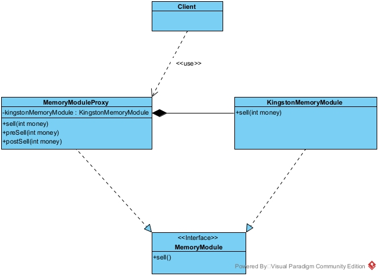


客户端Client类：

```java
/**
 * 使用代理模式的客户端（模拟用户购买金士顿内存条）
 */
public class Client {

    public static void main(String[] args) {
        //客户向内存条代理商给了150元购买内存条
        MemoryModuleProxy memoryModuleProxy = new MemoryModuleProxy();
        memoryModuleProxy.sell(150);
    }
}
```


内存条MemoryModule接口：

```java
/**
 * 内存条接口（抽象主题）
 */
public interface MemoryModule {

    /**
     * 出售内存条的方法
     */
    void sell(int money);
}
```


金士顿内存条KingstonMemoryModule类：

```java
/**
 * 金士顿内存条（真实主题）
 */
public class KingstonMemoryModule implements MemoryModule {

    @Override
    public void sell(int money) {
        System.out.println("金士顿厂商以" + money +  "的金额出售内存条");
    }
}
```


内存条代理商MemoryModuleProxy类：

```java
/**
 * 内存条代理商（代理）
 */
public class MemoryModuleProxy implements MemoryModule {

    /**
     * 持有金士顿内存条对象
     */
    private KingstonMemoryModule kingstonMemoryModule = new KingstonMemoryModule();

    @Override
    public void sell(int money) {
        preSell(money);

        //调用金士顿内存条的销售方法，默认金士顿厂商100元
        kingstonMemoryModule.sell(100);

        postSell(money);
    }

    /**
     * 打印代理商收取用户的钱（私有方法，让客户不可见）
     */
    private void preSell(int money) {
        System.out.println("代理商收取了客户" + money + "元钱");
    }

    /**
     * 打印代理商赚的钱（私有方法，让客户不可见）
     */
    private void postSell(int money) {
        System.out.println("代理商赚取了客户" + (money - 100) + "元钱");
    }
}
```

总结：

1.代理模式在客户端与目标对象之间起到一个中介作用和保护目标对象的作用。

2.代理对象可以扩展目标对象的功能。代理模式能将客户端与目标对象分离，在一定程度上降低了系统的耦合度，增加了程序的可扩展性。

3.代理模式会造成系统设计中类的数量增加，在客户端和目标对象之间增加一个代理对象，会造成请求处理速度变慢；增加了系统的复杂度。


典型运用场景举例：
当无法或不想直接引用某个对象或访问某个对象存在困难时，可以通过代理对象来间接访问。使用代理模式主要有两个目的：一是保护目标对象，二是增强目标对象。例如Spring AOP中就是基于代理模式来做到方法的增强，但使用的是动态代理技术。代理模式本身属于静态代理技术，动态代理是静态代理的升级。


## 4.6享元模式

享元模式运用共享技术来有效地支持大量细粒度对象的复用。它通过共享已经存在的对象来大幅度减少需要创建的对象数量、避免大量相似类的开销，从而提高系统资源的利用率。


进一步阐述：

享元模式的定义提出了两个要求，细粒度和共享对象。因为要求细粒度，所以不可避免地会使对象数量多且性质相近，此时我们就将这些对象的信息分为两个部分：内部状态和外部状态。

内部状态指对象共享出来的信息，存储在享元信息内部，并且不回随环境的改变而改变。

外部状态指对象得以依赖的一个标记，随环境的改变而改变，不可共享。


享元模式包含四种角色：

Flyweight（抽象享元角色）：是所有的具体享元类的基类，为具体享元规范需要实现的公共接口，非享元的外部状态以参数的形式通过方法传入。

Concrete Flyweight（具体享元角色）：实现抽象享元角色中所规定的接口。

Unsharable Flyweight（非享元角色)：是不可以共享的外部状态，它以参数的形式注入具体享元的相关方法中。

Flyweight Factory（享元工厂角色）：负责创建和管理享元角色。当客户对象请求一个享元对象时，享元工厂检査系统中是否存在符合要求的享元对象，如果存在则提供给客户；如果不存在的话，则创建一个新的享元对象。


案例：以一个简单的数据库连接池为例，我们不需要每次都创建数据库连接和销毁连接，这样可以避免资源开销，通过享元模式通过"池"的概念来进行，就是很好的方式。数据库连接DataBaseConnection接口就是抽象享元角色，JDBC数据库连接JDBCConnection类就是具体享元角色，JDBC数据库连接池JDBCConnectionPool类就是享元工厂角色，数据库的连接信息参数就是非享元角色。


UML类图：

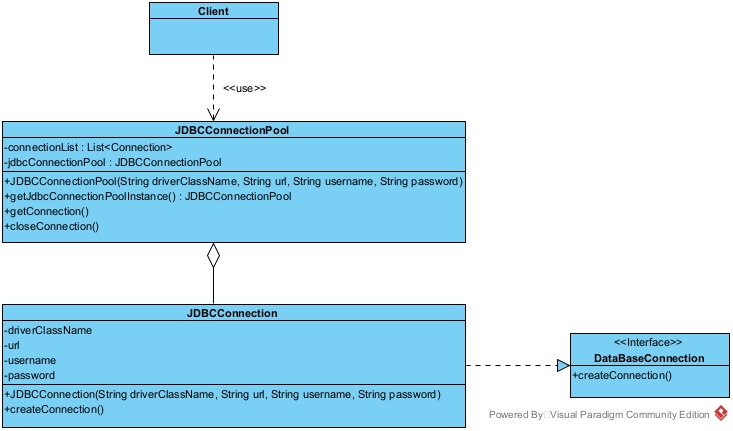


客户端Client类：

```java
/**
 * 使用享元模式的客户端
 */
public class Client {

    public static void main(String[] args) {
        String driverClassName = "com.mysql.jdbc.Driver";
        String url = "jdbc:mysql://127.0.0.1:3306/mybatis?serverTimezone=GMT%2B8&characterEncoding=utf8";
        String username = "root";
        String password = "123456";
        //创建连接池
        JDBCConnectionPool jdbcConnectionPool = JDBCConnectionPool
                .getJdbcConnectionPoolInstance(driverClassName, url, username, password);

        //获取连接
        Connection connection = jdbcConnectionPool.getConnection();
        System.out.println(connection);

        //归还连接
        jdbcConnectionPool.closeConnection(connection);
    }
}
```


数据库连接DataBaseConnection接口：

```java
/**
 * 数据库连接接口（抽象享元角色）
 */
public interface DataBaseConnection {

    /**
     * 创建连接
     */
    Connection createConnection();

}
```


JDBC数据库连接JDBCConnection类：

```java
/**
 * JDBC数据库连接（具体享元角色）
 */
public class JDBCConnection implements DataBaseConnection {
    /**
     * 数据库驱动
     */
    private final String driverClassName;

    /**
     * 数据库url
     */
    private final String url;

    /**
     * 数据库密码
     */
    private final String username;

    /**
     * 数据库密码
     */
    private final String password;

    /**
     * 初始化数据库信息（非享元角色）
     */
    public JDBCConnection(String driverClassName, String url, String username, String password) {
        this.driverClassName = driverClassName;
        this.url = url;
        this.username = username;
        this.password = password;
    }

    @Override
    public Connection createConnection() {
        try {
            Class.forName(driverClassName);
            return DriverManager.getConnection(url, username, password);
        } catch (Exception e) {
            return new RuntimeException(e);
        }
    }
}
```


JDBC数据库连接池JDBCConnectionPool类：

```java
/**
 * JDBC数据库连接池（享元工厂角色）
 */
public class JDBCConnectionPool {

    //维护数据库连接的集合
    private final List<Connection> connectionList = new ArrayList<>();

    //持有一个静态的连接池对象
    private volatile static JDBCConnectionPool jdbcConnectionPool;

    /**
     * 私有构造器
     */
    private JDBCConnectionPool(String driverClassName, String url, String username, String password) {
        if (jdbcConnectionPool != null) {
            throw new RuntimeException();
        }
        //初始化连接数，这里默认先写死10个
        for (int i = 0; i < 10; i++) {
            JDBCConnection jdbcConnection = new JDBCConnection(driverClassName, url, username, password);
            Connection connection = jdbcConnection.createConnection();
            connectionList.add(connection);
        }
    }

    /**
     * 返回相同的连接池对象
     */
    public static JDBCConnectionPool getJdbcConnectionPoolInstance(String driverClassName
            , String url, String username, String password) {
        if (jdbcConnectionPool == null) {
            synchronized (JDBCConnectionPool.class) {
                if (jdbcConnectionPool == null) {
                    jdbcConnectionPool = new JDBCConnectionPool(driverClassName, url, username, password);
                }
            }
        }
        return jdbcConnectionPool;
    }

    /**
     * 获取数据库连接
     */
   	public Connection getConnection() {
        //如果集合中还有连接，就获取一个返回给用户
        synchronized (JDBCConnectionPool.class) {
            if (!connectionList.isEmpty()) {
                Connection connection = connectionList.get(0);
                connectionList.remove(connection);
                return connection;
            }
        }
        //如果集合中没有连接了，那么就递归调用，等待有连接被归还
        return getConnection();
    }

    /**
     * 关闭连接（本质上是把连接放回集合中）
     */
    public void closeConnection(Connection connection) {
        connectionList.add(connection);
    }
}
```

总结：

1.相同对象只要保存一份，这降低了系统中对象的数量，从而降低了系统中细粒度对象给内存带来的压力。

2.为了使对象可以共享，需要将一些不能共享的状态外部化，这将增加程序的复杂性。

3.读取享元模式的外部状态会使得运行时间稍微变长。

4.享元模式其实是工厂方法模式的一个改进机制，享元模式同样要求创建一个或一组对象，并且就是通过工厂方法模式生成对象的，只不过享元模式为工厂方法模式增加了缓存这一功能。


典型运用场景举例：

系统中存在大量相同或相似的对象，这些对象耗费大量的内存资源，例如：数据库的连接池，线程池，对象池等。


## 4.7组合模式

组合模式的也叫做整体-部分模式，它是一种将对象组合成树状的层次结构的模式，用来表示“整体-部分”的关系，使用户对单个对象和组合对象具有一致的访问性。


进一步阐述：

组合模式一般用来描述整体与部分的关系，它将对象组织到树形结构中，顶层的节点被称为根节点，根节点下面可以包含树枝节点和叶子节点，树枝节点下面又可以包含树枝节点和叶子节点。其实就是我们常说的“树型结构”。


组合模式包含四种角色：

Component（抽象构件角色）：它的主要作用是为树叶构件和树枝构件声明公共接口，并实现它们的默认行为。在透明式的组合模式中抽象构件还声明访问和管理子类的接口；在安全式的组合模式中不声明访问和管理子类的接口，管理工作由树枝构件完成。（总的抽象类或接口，定义一些通用的方法，比如新增、删除）

Leaf（树叶构件角色）：是组合中的叶节点对象，它没有子节点，用于继承或实现抽象构件。

Composite（树枝构件角色 / 中间构件角色）：是组合中的分支节点对象，它有子节点，用于继承和实现抽象构件。它的主要作用是存储和管理子部件，通常包含 Add()、Remove()、GetChild() 等方法。


案例：实现当用户在商店购物后，显示其所选商品信息，并计算所选商品总价的功能。


UML类图：

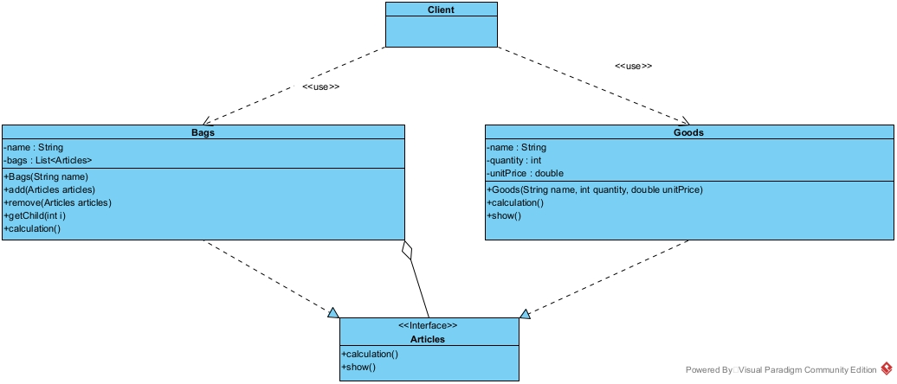


客户端Client类：

```java
/**
 * 使用组合模式的客户端
 */
public class Client {

    public static void main(String[] args) {
        Bags bigBag = new Bags("大商品袋");
        Bags mediumBag = new Bags("中商品袋");
        Bags smallBag = new Bags("小商品袋");

        Goods sneakers = new Goods("运动鞋", 1, 1198);
        Goods snacks = new Goods("零食", 5, 5);
        Goods vegetables = new Goods("蔬菜", 5, 1.5);

        //中商品袋中放入运动鞋
        mediumBag.add(sneakers);
        //小商品袋中放入零食和蔬菜
        smallBag.add(snacks);
        smallBag.add(vegetables);
        //把中商品袋和小商品袋一起放入大商品袋组合起来
        bigBag.add(mediumBag);
        bigBag.add(smallBag);
        //打印所有的商品信息
        bigBag.show();
        double total = bigBag.calculation();
        System.out.println("要支付的总价是:" + total);
    }
}
```


商店物品Articles接口：

```java
/**
 * 商店物品（抽象构件）
 */
public interface Articles {

    /**
     * 计算方法
     */
    double calculation();

    /**
     * 展示信息
     */
    void show();
}
```


袋子Bags类：

```java
/**
 * 袋子类（树枝构件）
 */
public class Bags implements Articles {

    /**
     * 袋子名称
     */
    private String name;

    /**
     * 持有商品的集合
     */
    private List<Articles> bags = new ArrayList<>();

    public Bags(String name) {
        this.name = name;
    }

    /**
     * 添加商品
     */
    public void add(Articles articles) {
        bags.add(articles);
    }

    /**
     * 删除商品
     */
    public void remove(Articles articles) {
        bags.remove(articles);
    }

    /**
     * 获取某一个商品
     */
    public Articles getChild(int i) {
        return bags.get(i);
    }

    /**
     * 计算所有价格
     */
    public double calculation() {
        BigDecimal total = new BigDecimal("0");
        for (Articles bag : bags) {
            total = total.add(BigDecimal.valueOf(bag.calculation()));
        }
        return total.doubleValue();
    }

    /**
     * 打印所有商品信息
     */
    public void show() {
        for (Articles bag : bags) {
            bag.show();
        }
    }
}
```


商品Goods类：

```java
/**
 * 商品类（树叶构件）
 */
public class Goods implements Articles {

    /**
     * 商品名称
     */
    private String name;

    /**
     * 商品数量
     */
    private int quantity;

    /**
     * 商品单价
     */
    private double unitPrice;

    public Goods(String name, int quantity, double unitPrice) {
        this.name = name;
        this.quantity = quantity;
        this.unitPrice = unitPrice;
    }

    @Override
    public double calculation() {
        return BigDecimal.valueOf(unitPrice)
                .multiply(BigDecimal.valueOf(quantity)).doubleValue();
    }

    @Override
    public void show() {
        System.out.println(name + "(数量：" + quantity + "，单价：" + unitPrice + "元)");
    }
}
```

总结：

1.组合模式使得客户端代码可以一致地处理单个对象和组合对象，无须关心自己处理的是单个对象，还是组合对象，这简化了客户端代码。

2.更容易在组合体内加入新的对象，客户端不会因为加入了新的对象而更改源代码，满足“开闭原则”。

3.设计较复杂，客户端需要花更多时间理清类之间的层次关系。不容易限制容器中的构件。不容易用继承的方法来增加构件的新功能。


典型运用场景举例：

在需要表示一个对象整体与部分的层次结构的场合。例如：文件目录显示，多及目录呈现等。

要求对用户隐藏组合对象与单个对象的不同，用户可以用统一的接口使用组合结构中的所有对象的场合，比如树形结构中的二叉树。


# 5.行为型设计模式

行为型设计模式：从方法的角度去思考如何让方法显得更合理而产生的类型。

## 5.1策略模式

策略模式将各种不同类型所对应的不同执行逻辑抽象成算法族（策略组），并分别封装起来，让他们之间可以互相替换，这样就将算法的变化和使用算法的客户端分离开来；这样体现了几个设计原则，第一、把变化的代码从不变的代码中分离出来；第二、针对接口编程而不是具体类（定义了策略接口）；第三、多用组合/聚合，少用继承（客户通过组合方式使用策略）。


进一步阐述：策略模式就是解决具体逻辑和客户端耦合在一起的问题，其核心是找到项目中变化的部分并进行抽离出来成为一个接口，项目中不变的部分就直接使用接口调用抽象方法即可。


策略模式包含三种角色：
Context（环境角色）：用来操作策略的上下文环境，它持有一个Strategy的引用；
Strategy（抽象策略角色）：所有策略的抽象，封装了需要去执行的项目中不变的部分逻辑；
ConcreteStrategy （具体策略角色）：抽象策略的实现，每一种不同的逻辑执行方式就是一个具体的策略类；


案例：我们以一个旅行者为例，旅行的方式有很多种，可以坐高铁，也可以坐飞机，这取决于用户自己的选择。其中旅行者Traveler类就是环境角色，旅行策略TravelingStrategy接口就是抽象策略角色，飞机旅行策略AirTravelingStrategy实现类和高铁旅行策略HightTrainTravelingStrategy实现类就是具体的策略角色。


UML类图：

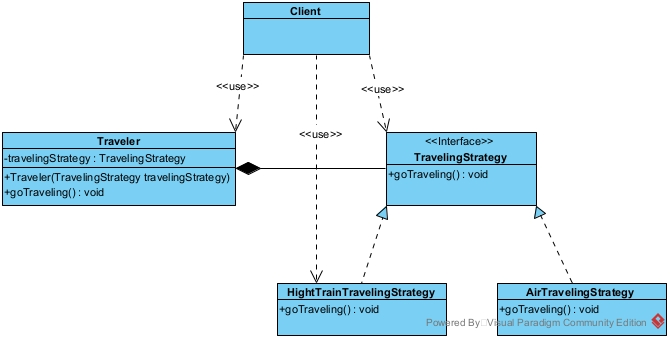


客户端Client类：

```java
/**
 * 客户端
 */
public class Client {

    public static void main(String[] args) {

        Traveler traveler = new Traveler(new HightTrainTravelingStrategy());

        traveler.goTraveling();
    }
}
```


旅行者Traveler类：

```java
/**
 * 旅行者类
 */
public class Traveler {

    //持有一个旅行策略接口的实现类
    private TravelingStrategy travelingStrategy;

    public Traveler(TravelingStrategy travelingStrategy) {
        this.travelingStrategy = travelingStrategy;
    }

    public void goTraveling() {
        //省去了繁琐的if-- else if -- else if
        travelingStrategy.goTraveling();
    }
}
```


旅行策略TravelingStrategy接口：

```java
/**
 * 旅行策略接口
 */
public interface TravelingStrategy {

    /**
     * 去旅游方法
     */
    void goTraveling();
}
```


高铁旅行策略HightTrainTravelingStrategy实现类：

```java
/**
 * 高铁旅行策略实现类
 */
public class HightTrainTravelingStrategy implements TravelingStrategy {

    @Override
    public void goTraveling() {
        System.out.println("乘坐高铁去旅行……");
    }
}
```


飞机旅行策略AirTravelingStrategy实现类：

```java
/**
 * 飞机旅行策略实现类
 */
public class AirTravelingStrategy implements TravelingStrategy {

    @Override
    public void goTraveling() {
        System.out.println("乘坐飞机去旅行……");
    }
}
```

总结：
1.客户端增加行为不用修改原有代码，只要添加一种策略（或者行为）即可，避免了使用if--else if--else if去完成逻辑的编程的情况，是典型的if--else if--else if的“杀手”，因为遵守了开闭原则（OCP原则），所以极大地提高了软件的可扩展性、可维护性。
2.策略模式的核心思想是：多用组合或者聚合少用继承；用行为类进行组合，而不是行为类进行继承，这样耦合度降低了，这样就替换了用继承关系解决问题的办法，策略模式将算法封装在独立的 Strategy 类中使得你可以独立于其 Context 改变它，使它易于切换、易于理解、易于扩展遵守了合成复用原则。
3.使用策略模式的客户端必须知道所有的策略类，并自行决定使用哪一个策略类。
4.策略模式如果策略有很多那么就会出现很多的策略类增加了系统类的复杂度。
5.context在使用这些策略类的时候，这些策略类由于实现了策略接口，所以有些数据可能用不到，但是依然初始化了，这样就造成了内存的浪费。


典型运用场景举例：
电商项目的优惠活动管理：
优惠的策略有很多种，包括满减类型优惠策略、打折类优惠策略、赠送礼品策略、发放优惠券策略。


## 5.2模板方法模式

模板方法模式又叫模板模式(Template Pattern)，属于行为型设计模式，它在一个抽象类中公开定义了需要执行的方法的模板，它的子类可以按需要重写细节方法，但调用将以抽象类中定义的方式进行。


进一步阐述：
模板方法模式是定义了一个逻辑算法的骨架，而将一些具体的变化的步骤延迟到子类中去实现，使得子类可以不改变一个算法的结构，就可以重定义该算法的某些特定步骤。


模板方法模式包含二种角色：
AbstractClass（抽象角色）：是一个抽象类，其内部定义了模板方法，也就是定义了整个算法的骨架和组成这个算法的各个步骤（这些步骤有具体的也有抽象的），它具体负责指挥整个算法的流程；
ConcreteClass（具体角色）：继承了抽象角色，去重写步骤中变化部分的抽象方法。


案例：以泡功夫茶为例，泡功夫茶必须按照严格的步骤进行一步一步去做，最后喝到的才能是清香沁人上等茶品，其具体步骤是：沸水烫壶-->加入茶叶-->头茶洗茶-->养护茶宠-->首道闻香-->泡茶品茶


UML类图：

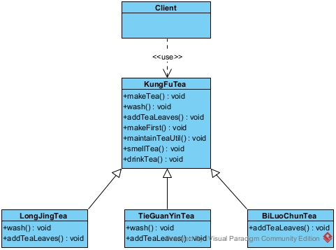


Client客户端类：

```java
/**
 * 客户端
 */
public class Client {

    public static void main(String[] args) {
        //泡龙井茶
        System.out.println("----------泡龙井茶----------------");
        KungFuTea longjingTea = new LongJingTea();
        longjingTea.makeTea();

        //泡铁观音茶
        System.out.println("----------泡铁观音茶----------------");
        KungFuTea tieGuanYinTea = new TieGuanYinTea();
        tieGuanYinTea.makeTea();

        //泡碧螺春茶
        System.out.println("----------泡碧螺春茶----------------");
        KungFuTea biLuoChunTea = new BiLuoChunTea();
        biLuoChunTea.makeTea();
    }
}
```


泡功夫茶的KungFuTea抽象类：

```java
/**
 * 泡功夫茶的抽象类
 */
public abstract class KungFuTea {

    /**
     * 模板方法：用于定义整个算法的骨架，确定好整个算法的步骤顺序
     */
    public void makeTea() {
        wash();
        addTeaLeaves();
        makeFirst();
        maintainTeaUtil();
        smellTea();
        drinkTea();
    }

    /**
     * 1、沸水烫壶：“钩子”方法，默认空实现
     */
    protected void wash() {

    }

    /**
     * 2、加入茶叶
     */
    public abstract void addTeaLeaves();

    /**
     * 3、头茶洗茶
     */
    public void makeFirst() {
        System.out.println("加入第一次冲泡的热水，冲泡5-15秒，然后将茶倒入滤杯中。");
    }

    /**
     * 4、养护茶宠
     */
    public void maintainTeaUtil() {
        System.out.println("将第一次冲泡滤出来的茶水冲洗茶具。");
    }

    /**
     * 5、首道闻香
     */
    public void smellTea() {
        System.out.println("将首道茶水倒入闻香杯，捧杯闻香。");
    }

    /**
     * 6、泡茶品茶
     */
    public void drinkTea() {
        System.out.println("将沸水倒入紫砂壶，加盖泡制20秒，倒出后开始品尝。");
    }
}
```


泡龙井功夫茶LongJingTea类：

```java
/**
 * 泡龙井功夫茶
 */
public class LongJingTea extends KungFuTea {
    @Override
    public void wash() {
        System.out.println("用预热的泉水加热和冲洗宜兴紫砂茶壶（或盖碗）");
    }

    @Override
    public void addTeaLeaves() {
        System.out.println("加入龙井茶茶叶。");
    }
}
```


泡铁观音功夫茶TieGuanYinTea类：

```java
/**
 * 泡铁观音功夫茶
 */
public class TieGuanYinTea extends KungFuTea {
    @Override
    public void wash() {
        System.out.println("用预热的泉水加热和冲洗宜兴紫砂茶壶（或盖碗）");
    }

    @Override
    public void addTeaLeaves() {
        System.out.println("加入铁观音茶茶叶。");
    }
}
```


泡碧螺春功夫茶BiLuoChunTea类：

```java
/**
 * 碧螺春功夫茶类
 */
public class BiLuoChunTea extends KungFuTea {

    @Override
    public void addTeaLeaves() {
        System.out.println("加入碧螺春茶茶叶。");
    }
}
```

总结：
1.模板方法模式是将一个通用的算法抽离出来存放于一个公用的地方，也就是在父类中，提高代码的可复用性。如果整个算法的骨架需要变更只需要修改父类的模板方法或者已经实现的某些步骤，子类就会继承这些修改。
2.它既统一了算法，也提供了很大的灵活性。父类的模板方法确保了算法的结构保持不变，同时由子类提供变化步骤的实现。
3.一般模板方法都加上会final关键字，防止子类重写模板方法去破坏掉整个算法的骨架体系。
4.将一些可选步骤在抽象角色中设计为空实现即“钩子”方法，一般是用protected去修饰，方便子类去选择是否选用。
5.每一个不同的细节都需要一个子类实现，导致类的个数增加从而增大系统类的复杂度。


典型运用场景举例：
当实现一个逻辑时，整体步骤是很固定的，但是某些细节步骤是具有很多变化的可能的，那么就可以使用模板方法模式进行设计。例如：jdbc访问数据库、操作各种非关系型数据库。


## 5.3观察者模式

观察者模式定义了一种一对多的依赖关系，让多个观察者对象同时监听某一个主题对象。这个主题对象在状态变化时，会通知所有的观察者对象，使他们能够自动更新自己。


进一步阐述：观察者是一种行为型设计模式，当主题对象发生变化的行为时，会通知所有的观察者，使其所有的观察者去自动更新自己。


观察者模式包含四种角色：
Subject（抽象主题角色）：抽象主题角色会提供三个方法，分别可以增加观察者对象、删除观察者对象和自己状态发生变化时通知所有的观察者对象更新；
ConcreteSubject（具体主题角色）：它实现了抽象主题角色接口，它聚合了所有的观察者对象，把所有观察者对象保存在一个集合里，可以有任意数量的观察者（这里体现了一对多的关系），提供具体的将有关状态存入具体观察者对象，在具体主题的内部状态发生改变时，给所有注册过的观察者发送通知的功能；
Observer（抽象观察者接口）：提供一个具体主题状态变化时所调用的抽象更新方法，使得在得到主题更改通知时更新自己；
ConcrereObserver（具体观察者），实现了抽象观察者接口，并重写了更新方法去实现具体的逻辑处理，也可以在这个更新方法里面回调主题对象，以获取到主题对象的数据。


案例：明星发布动态后关注他的粉丝能够及时知道并展示关注的明星所发出的最新的动态为例。明星Strat接口就是抽象主题角色，具体明星ConcreteStar类就是具体主题角色，粉丝Fan接口就是抽象观察者接口，台湾省粉丝TailWanFan类和浙江省粉丝ZheJiangFan类就是具体观察者。


UML类图：

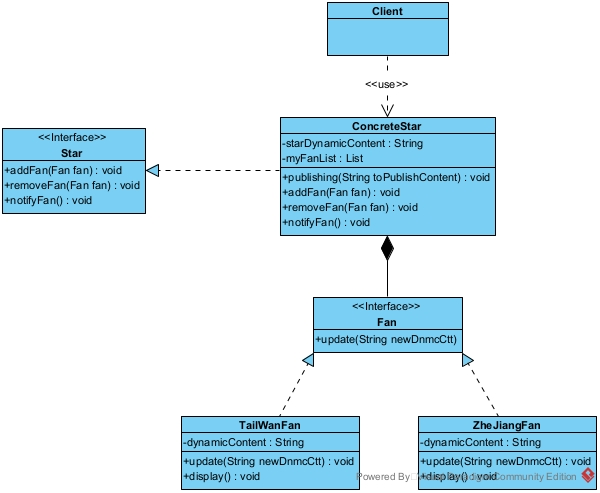


客户端Client类：

```java
/**
 * 使用观察者模式的客户端
 */
public class Client {

    public static void main(String[] args) {
        //创建主题
        ConcreteStar star = new ConcreteStar();

        //创建观察者
        TailWanFan tailWanFan = new TailWanFan();
        ZheJiangFan zheJiangFan = new ZheJiangFan();

        //设置观察者需要观察的主题
        star.addFan(tailWanFan);
        //新增一个观察者
        star.addFan(zheJiangFan);
        //删除一个观察者
        star.removeFan(zheJiangFan);

        //明星发布一条动态
        star.publishing("王力宏离婚了，其具体原因是……此处省略5000字");
    }
}
```


明星Star接口：

```java
/**
 * 明星接口（抽象主题角色）
 */
public interface Star {

    /**
     * 新增粉丝方法
     */
    void addFan(Fan fan);

    /**
     * 删除粉丝方法
     */
    void removeFan(Fan fan);

    /**
     * 通知粉丝有新动态的方法
     */
    void notifyFan();
}
```


具体明星ConcreteStar类：

```java
/**
 * 具体明星类（具体主题角色）
 * 包含最新的动态的内容，还包含关注的所有粉丝，当明星发动态的时候，这里使用推模式主动调用
 * 粉丝对象的更新方法，然后让关注的粉丝知道最新的态的内容。
 */
public class ConcreteStar implements Star {

    /*
     * 最新发布的动态内容
     */
    private String starDynamicContent;

    /*
     * 关注我的粉丝们
     */
    private List<Fan> myFanList = new ArrayList<>();


    /**
     * 发布一条新的动态方法
     *
     * @param toPublishContent
     */
    public void publishing(String toPublishContent) {
        this.starDynamicContent = toPublishContent;
        //由于使用的是推模式，所以主动调用
        notifyFan();
    }

    @Override
    public void addFan(Fan fan) {
        myFanList.add(fan);
    }

    @Override
    public void removeFan(Fan fan) {
        myFanList.remove(fan);
    }

    @Override
    public void notifyFan() {
        for (Fan f : myFanList) {
            f.update(starDynamicContent);
        }
    }
}
```


粉丝Fan接口：

```java
/**
 * 粉丝接口
 */
public interface Fan {

    /**
     * 更新动态内容方法
     */
    void update(String newDnmcCtt);
}
```


台湾省粉丝TailWanFan类：

```java
/**
 * 台湾省粉丝类
 */
public class TailWanFan implements Fan {

    /*
     * 关注的明星发的动态内容
     */
    private String dynamicContent;

    /**
     * 更新动态内容方法
     */
    @Override
    public void update(String newDnmcCtt) {
        this.dynamicContent = newDnmcCtt;
        display();
    }

    /**
     * 显示关注明星动态方法
     */
    public void display() {
        System.out.println("台湾粉丝知道了关注的明星的最新动态是：" + dynamicContent);
    }
}
```


浙江省粉丝ZheJiangFan类：

```java
/**
 * 浙江省粉丝类
 */
public class ZheJiangFan implements Fan {

    /*
     * 关注的明星发的动态内容
     */
    private String dynamicContent;

    /**
     * 更新动态内容方法
     */
    @Override
    public void update(String newDnmcCtt) {
        this.dynamicContent = newDnmcCtt;
        display();
    }

    /**
     * 显示关注明星动态方法
     */
    public void display() {
        System.out.println("浙江粉丝知道了关注的明星的最新动态是：" + dynamicContent);
    }
}
```

总结：

1.观察者模式实现了表示层和数据逻辑层的分离，这样就降低了表示层和数据逻辑层的耦合度，遵守了单一职能原则。
2.在观察目标和观察者之间建立了一个抽象的耦合，使得观察者和观察目标之间可以独立的变化和扩展，观察目标依赖的是一组观察者的抽象，这样就遵守了依赖倒置原则。
3.观察者模式支持广播通信，这样就在观察目标状态发生变化的时候可以很好的去通知到所有的观察者们，当要增加新的观察者或者删除观察者的时候只需要调用原有观察目标对象的方法即可，这样就遵守了开闭原则，大大提高了系统的可维护性和可扩展性。
4.如果一个观察目标对象有很多直接和间接的观察者的情况，此时要通知所有的观察者就会花费很多时间，对系统效率很有很大影响。
5.在观察者和观察目标之间如果有循环依赖，那么观察目标会触发它们之间进行循环调用，可能导致系统崩溃。


典型运用场景举例：
电商系统中的下单场景：
当用户购买某件商品下了一个订单时, 此时需要通知库存系统减少库存、通知商家系统发货、通知支付系统收钱、甚至还会通知关系中心使当前用户关注该商家。
聊天室系统中的在群聊中发消息场景：
当一个用户在群聊中发送了一条信息时, 此时需要通知到所有在这个群聊中的群成员。


## 5.4责任链模式

责任链模式，又叫职责链模式，将能够处理同一类请求的对象连成一条链，然后将请求的发送者和接收者进行了解耦；责任链模式会将所提交的请求沿着接收者的链进行传递，链上的对象逐个判断是否有能力处理该请求，如果能处理则处理，如果不能处理就传递给接收者链上的下一个对象，以此类推。


进一步阐述：责任链模式属于行为型模式，每个接收者都包含对另一个接收者的引用，以此形成接收者的链。


责任链模式包含三种角色：
Handler（抽象处理者）：只能是一个抽象类，它定义了一个处理请求的方法, 同时包含另外 Handler的引用；
ConcreteHandler（具体处理者）：继承了抽象处理者，负责处理它能处理的请求，并可以访问它的下一个处理者，如果能处理当前请求则处理，如果不能处理就将该请求交给下一个处理者去处理，从而形成一个责任链；
Request （请求对象）：含有很多需要处理的属性，表示一个需要被处理的请求。


案例：税务系统的收税逻辑：月收入<=5000时不纳税；5000<月收入<=8000时，超过5000部分缴纳5%的税费；8000<月收入<=15000时，在缴纳超出5000部分的税费后超过8000部分缴纳10%的税费；15000<月收入<=30000时，在缴纳超出5000部分和超出8000部分的税费后超过15000部分缴纳15%的税费。税费管理服务TaxationService抽象类就是抽象处理者，税费计算请求对象TaxationCalculateRequest类就是请求对象，其他处理税费的类都是具体的处理者。**PS：为了方便阅读，案例中的代码我们暂不考虑小数计算的精度问题**


UML类图：

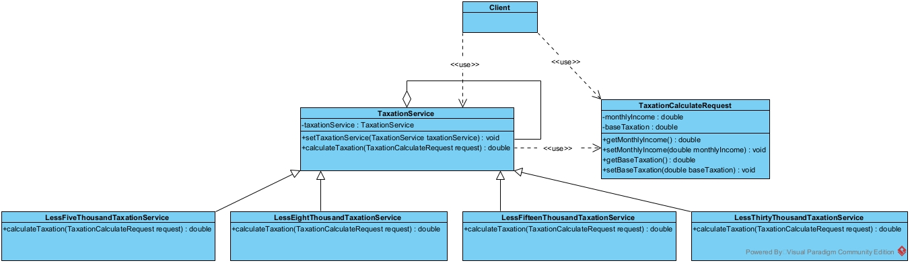


客户端Client：

```java
/**
 * 使用责任链模式的客户端
 */
public class Client {

    public static void main(String[] args) {
        //创建各个税费计算对象
        TaxationService taxationService1 = new LessFiveThousandTaxationService();
        TaxationService taxationService2 = new LessEightThousandTaxationService();
        TaxationService taxationService3 = new LessFifteenThousandTaxationService();
        TaxationService taxationService4 = new LessThirtyThousandTaxationService();

        //构建计算的责任链
        taxationService1.setTaxationService(taxationService2);
        taxationService2.setTaxationService(taxationService3);
        taxationService3.setTaxationService(taxationService4);

        //计算月收入4500的税费
        TaxationCalculateRequest request = new TaxationCalculateRequest();
        request.setMonthlyIncome(4500);
        double taxation = taxationService1.calculateTaxation(request);
        System.out.println("月收入4500元应该缴纳的税费是：" + taxation);

        //计算月收入7500的税费
        request.setMonthlyIncome(7500);
        taxation = taxationService1.calculateTaxation(request);
        System.out.println("月收入7500元应该缴纳的税费是：" + taxation);

        //计算月收入11000的税费
        request.setMonthlyIncome(11000);
        taxation = taxationService1.calculateTaxation(request);
        System.out.println("月收入11000元应该缴纳的税费是：" + taxation);

        //计算月收入19000的税费
        request.setMonthlyIncome(19000);
        taxation = taxationService1.calculateTaxation(request);
        System.out.println("月收入19000元应该缴纳的税费是：" + taxation);
    }
}
```


 税费管理服务TaxationService抽象类：

```java
/**
 * 税费管理服务（抽象处理者）
 */
public abstract class TaxationService {

    /*
     * 持有一个自己类型的引用也就是持有下一个处理者
     */
    protected TaxationService taxationService;

    /**
     * 也就是setNext方法
     */
    public void setTaxationService(TaxationService taxationService) {
        this.taxationService = taxationService;
    }

    /**
     * 计算税费的方法
     *
     * @param request 税费请求对象
     * @return 应缴纳的税费
     */
    public abstract double calculateTaxation(TaxationCalculateRequest request);

}
```


5000元及以下税费计算服务LessFiveThousandTaxationService类：

```java
/**
 * 5000元及以下税费计算服务（具体处理者）
 */
public class LessFiveThousandTaxationService extends TaxationService {

    /**
     * 计算税费的方法
     *
     * @param request 税费请求对象
     * @return 应缴纳的税费
     */
    public double calculateTaxation(TaxationCalculateRequest request) {
        if (request.getMonthlyIncome() <= 5000) {
            return 0.0;
        }
        return taxationService.calculateTaxation(request);
    }
}
```


8000元及以下税费计算服务LessEightThousandTaxationService类：

```java
/**
 * 8000元及以下税费计算服务（具体处理者）
 */
public class LessEightThousandTaxationService extends TaxationService {

    /**
     * 计算税费的方法
     *
     * @param request 税费请求对象
     * @return 应缴纳的税费
     */
    public double calculateTaxation(TaxationCalculateRequest request) {
        double monthlyIncome = request.getMonthlyIncome();
        if (monthlyIncome <= 8000) {
            return request.getBaseTaxation() + (monthlyIncome - 5000) * 0.05;
        }
        request.setBaseTaxation((8000 - 5000) * 0.05);
        return taxationService.calculateTaxation(request);
    }
}
```


15000元及以下税费计算服务LessFifteenThousandTaxationService类：

```java
/**
 * 15000元及以下税费计算服务（具体处理者）
 */
public class LessFifteenThousandTaxationService extends TaxationService {

    /**
     * 计算税费的方法
     *
     * @param request 税费请求对象
     * @return 应缴纳的税费
     */
    public double calculateTaxation(TaxationCalculateRequest request) {
        double monthlyIncome = request.getMonthlyIncome();
        if (monthlyIncome <= 15000) {
            return request.getBaseTaxation() + (monthlyIncome - 8000) * 0.1;
        }
        request.setBaseTaxation(request.getBaseTaxation() + (15000 - 8000) * 0.1);
        return taxationService.calculateTaxation(request);
    }
}
```


30000元及以下税费计算服务LessThirtyThousandTaxationService类：

```java
/**
 * 30000元及以下税费计算服务（具体处理者）
 */
public class LessThirtyThousandTaxationService extends TaxationService {

    /**
     * 计算税费的方法
     *
     * @param request 税费请求对象
     * @return 应缴纳的税费
     */
    public double calculateTaxation(TaxationCalculateRequest request) {
        double monthlyIncome = request.getMonthlyIncome();
        if (monthlyIncome <= 30000) {
            return request.getBaseTaxation() + (monthlyIncome - 15000) * 0.15;
        }
        request.setBaseTaxation(request.getBaseTaxation() + (30000 - 15000) * 0.15);
        return taxationService.calculateTaxation(request);
    }
}
```


税费计算请求对象TaxationCalculateRequest类：

```java
/**
 * 税费计算请求对象（请求对象）
 */
public class TaxationCalculateRequest {

    /*
     * 月收入
     */
    private double monthlyIncome;

    /*
     * 基础税费
     */
    private double baseTaxation;

    public double getBaseTaxation() {
        return baseTaxation;
    }

    public void setBaseTaxation(double baseTaxation) {
        this.baseTaxation = baseTaxation;
    }

    public double getMonthlyIncome() {
        return monthlyIncome;
    }

    public void setMonthlyIncome(double monthlyIncome) {
        this.monthlyIncome = monthlyIncome;
    }
}
```

总结：

1.将请求和处理分开，实现解耦，提高了系统的灵活性遵守了单一职能原则。

2.简化了请求对象，使请求对象不需要知道链的结构，遵守了迪米特法则。
3.如果责任链比较长，那么系统性能会受到很大影响，因此需控制链中最大节点数量，一般通过在Handler 
中设置一个最大节点数量，在setNext()方法中判断是否已经超过阀值，超过则不允许该链建立，避免出现超长链而影响系统性能的情况发生。

4.调试不方便，采用了类似递归的方式，调试时逻辑可能比较复杂必须跟着链去一个一个地寻找出错点。


典型运用场景举例：
OA系统中的请假、文件审批等审批流程；
学校教务系统中的奖学金审批、处分表扬审批；
电商系统中的多重打折和优惠叠加计算折后价格的场景。


## 5.5委派模式

委派模式是将具体由调用者去实现的功能将其委托交付给一个或多个中间者进行处理，处理完成后又回复给调用者的模式。


进一步阐述：我们可以理解成上级分配任务到具体的员工，比如说一个大老板手下有上千个员工，平常端茶递水的活肯定不是自己干。一般口渴了就会跟下面经理说：小张啊 我口渴了给我倒杯茶！然后张经理面带微笑着回答：好的老板，这就给您倒茶。然后张经理跟下面的员工说：小刘啊，去倒杯茶过来快点哟！一会小刘把茶端过来递给张经理，张经理屁颠屁颠地把茶送到老板面前说：您要的茶来了，有点热您注意别烫着啊。这整个流程就是委派模式，老板将倒茶任务委派给张经理，张经理再将倒茶任务委派给小刘。


委派模式包含三种角色：
AbstractTask （抽象任务角色）：是一个抽象类或者接口，含有需要处理的数据逻辑的方法，表示一个需要被执行的任务；
Delegater（委派者）：实现或者继承了抽象任务角色，持有一个抽象任务角色（即被委派者）的引用并提供一个方法将任务委派给具体任务角色；
ConcreteTask（具体任务角色）：实现或者继承了抽象任务角色，也是被委派者，负责具体去执行分派的任务的逻辑。


案例：上级分配经理去倒水，经理再委派给普通员工去倒水为例。其中员工Employee接口就是抽象任务角色，经理Manager类就是委派者，普通员工OrdinaryEmployee类就是具体任务角色。


UML类图：

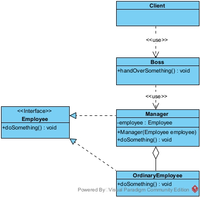


客户端Client类：

```java
/**
 * 使用委派模式的客户端
 */
public class Client {

    public static void main(String[] args) {
        Boss boss = new Boss();
        boss.handOverSomething();
    }
}
```


老板Boss类：

```java
/**
 * 老板类
 */
public class Boss {

    /**
     * 交代经理去做某事
     */
    public void handOverSomething() {
        Manager mng = new Manager(new OrdinaryEmployee());
        mng.doSomething();
    }
}
```


员工Employee接口：

```java
/**
 * 员工接口（抽象任务角色）
 */
public interface Employee {

    /**
     * 做某事
     */
    void doSomething();
}
```


经理Manager类：

```java
/**
 * 经理类（委派者角色）
 */
public class Manager implements Employee {

    private Employee employee;

    public Manager(Employee employee) {
        this.employee = employee;
    }

    /**
     * 做某事
     */
    @Override
    public void doSomething() {
        employee.doSomething();
    }
}
```


普通员工OrdinaryEmployee类：

```java
/**
 * 普通员工类（具体任务角色也是被委派者）
 */
public class OrdinaryEmployee implements Employee {

    /**
     * 做倒茶水这件事
     */
    @Override
    public void doSomething() {
        System.out.println("您的茶来了，我刚倒的茶有点热您注意别烫着啊！");
    }
}
```

总结：
1.委派的核心：就是对任务进行分发、调度、派遣。
2.委派模式和代理模式的区别：代理模式注重的是过程，委派模式注重的是结果。
3.委派模式和策略模式的区别：策略模式注重是可扩展性（外部扩展），委派模式注重内部的灵活和复用。
4.将具体的任务和发布这个任务的调用者中间加上了一个缓冲的相当于中介者一样，使得逻辑的职能分工更加细化和明确，更好的遵守了单一职能原则。
5.在中间的委派者角色中关联了具体的任务（即被委派者），这样就遵守合成复用原则。


典型运用场景举例：
电商的库存系统中当卖出一件商品或者是商品的数量经过商品管理服务进行修改后，不是直接去调用库存管理服务执行减库存的逻辑，而是委派给消息中间件去做，然后消息中间件又将减库存的任务委派给相关的库存服务执行。


## 5.6状态模式

状态模式是指对有状态的对象，把复杂的“判断逻辑”提取到不同的状态对象中，允许状态对象在其内部状态发生改变时改变其行为。


进一步阐述：

当控制一个对象状态转换的条件表达式过于复杂时，把相关“判断逻辑”提取出来，用各个不同的类进行表示，系统处于哪种情况，直接使用相应的状态类对象进行处理，这样能把原来复杂的逻辑判断简单化，消除了 if-else、switch-case 等冗余语句，代码更有层次性，并且具备良好的扩展力。


状态模式包含三种角色：

Context（环境类角色）：也称为上下文，它定义了客户端需要的接口，内部维护一个当前状态，并负责具体状态的切换。

State（抽象状态角色）：定义一个接口，用以封装环境对象中的特定状态所对应的行为，可以有一个或多个行为。

Concrete State（具体状态角色）：实现抽象状态所对应的行为，并且在需要的情况下进行状态切换。


案例：以一个学生成绩的状态转换为例。本实例包含了“不及格”，“中等”和“优秀” 3 种状态，当学生的分数小于 60 分时为“不及格”状态，当分数大于等于 60 分且小于 90 分时为“中等”状态，当分数大于等于 90 分时为“优秀”状态。其中学生成绩状态测试ScoreContext类就是环境类角色，学生成绩状态AbstractState抽象类就是抽象状态角色，不及格状态LowState类、中等状态MiddleState类、优秀状态HighState类就是具体的状态角色。


UML类图：

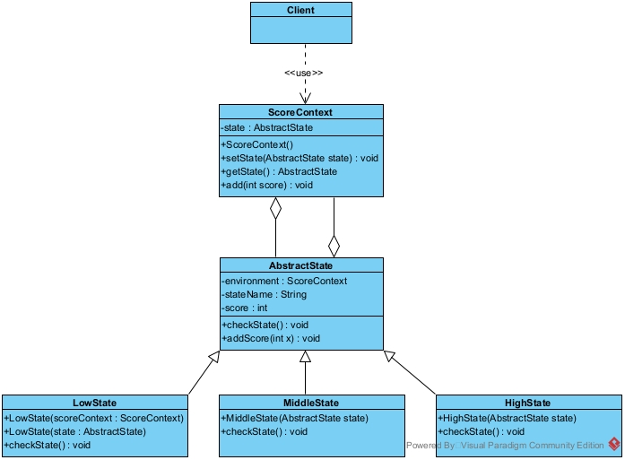


客户端Client类：

```java
/**
 * 使用状态模式的客户端
 */
public class Client {

    public static void main(String[] args) {
        ScoreContext account = new ScoreContext();
        System.out.println("学生成绩状态测试：");
        account.add(30);
        account.add(40);
        account.add(25);
        account.add(-15);
        account.add(-25);
    }
}
```


学生成绩状态测试ScoreContext类：

```java
/**
 * 学生成绩状态测试类（环境类）
 */
public class ScoreContext {

    private AbstractState state;

    ScoreContext() {
        state = new LowState(this);
    }

    public void setState(AbstractState state) {
        this.state = state;
    }

    public AbstractState getState() {
        return state;
    }

    public void add(int score) {
        state.addScore(score);
    }
}
```


学生成绩状态AbstractState抽象类：

```java
/**
 * 抽象状态类
 */
public abstract class AbstractState {

    //环境
    protected ScoreContext hj;

    //状态名
    protected String stateName;

    //分数
    protected int score;

    /**
     * 检查当前状态
     */
    public abstract void checkState();

    public void addScore(int x) {
        score += x;
        System.out.print("加上：" + x + "分，\t当前分数：" + score);
        checkState();
        System.out.println("分，\t当前状态：" + hj.getState().stateName);
    }
}
```


不及格状态LowState类：

```java
/**
 * 不及格（具体状态类）
 */
public class LowState extends AbstractState {

    public LowState(ScoreContext h) {
        hj = h;
        stateName = "不及格";
        score = 0;
    }

    public LowState(AbstractState state) {
        hj = state.hj;
        stateName = "不及格";
        score = state.score;
    }

    public void checkState() {
        if (score >= 90) {
            hj.setState(new HighState(this));
        } else if (score >= 60) {
            hj.setState(new MiddleState(this));
        }
    }
}
```


中等状态MiddleState类：

```java
/**
 * 中等 （具体状态类）
 */
public class MiddleState extends AbstractState {

    public MiddleState(AbstractState state) {
        hj = state.hj;
        stateName = "中等";
        score = state.score;
    }

    public void checkState() {
        if (score < 60) {
            hj.setState(new LowState(this));
        } else if (score >= 90) {
            hj.setState(new HighState(this));
        }
    }
}
```


优秀状态HighState类：

```java
/**
 * 优秀
 */
public class HighState extends AbstractState {

    public HighState(AbstractState state) {
        hj = state.hj;
        stateName = "优秀";
        score = state.score;
    }

    public void checkState() {
        if (score < 60) {
            hj.setState(new LowState(this));
        } else if (score < 90) {
            hj.setState(new MiddleState(this));
        }
    }
}
```

总结：

1.结构清晰，状态模式将与特定状态相关的行为局部化到一个状态中，并且将不同状态的行为分割开来，满足“单一职责原则”。

2.将状态转换显示化，减少对象间的相互依赖。将不同的状态引入独立的对象中会使得状态转换变得更加明确，且减少对象间的相互依赖。

3.状态类职责明确，有利于程序的扩展。通过定义新的子类很容易地增加新的状态和转换。

4.状态模式的使用必然会增加系统的类与对象的个数。状态模式的结构与实现都较为复杂，如果使用不当会导致程序结构和代码的混乱。

5.状态模式对开闭原则的支持并不太好，对于可以切换状态的状态模式，增加新的状态类需要修改那些负责状态转换的源码，否则无法切换到新增状态，而且修改某个状态类的行为也需要修改对应类的源码。


典型运用场景举例：

一个操作中含有庞大的分支结构，并且这些分支决定于对象的状态时，例如条件、分支判断语句的替代者。

工作流场景的设计，例如审批流程，请假流程，状态会随着审批者的审批结果而改变。


## 5.7中介者模式

中介者模式是指定义一个中介对象来封装一系列对象之间的交互，使原有对象之间的耦合松散，且可以独立地改变它们之间的交互。中介者模式又叫调停模式，它是迪米特法则的典型应用。


进一步阐述：

在现实生活中，常常会出现好多对象之间存在复杂的交互关系，这种交互关系常常是“网状结构”，它要求每个对象都必须知道它需要交互的对象。例如，每个人必须记住他（她）所有朋友的电话；而且，朋友中如果有人的电话修改了，他（她）必须让其他所有的朋友一起修改，这叫作“牵一发而动全身”，非常复杂。如果把这种“网状结构”改为“星形结构”的话，将大大降低它们之间的“耦合性”，这时只要找一个“中介者”就可以了。如前面所说的“每个人必须记住所有朋友电话”的问题，只要在网上建立一个每个朋友都可以访问的“通信录”就解决了。这样的例子还有很多，例如，你刚刚参加工作想租房，可以找“房屋中介”；或者，自己刚刚到一个陌生城市找工作，可以找“人才交流中心”帮忙。


中介者模式包含四种角色：

Mediator（抽象中介者角色）：它是中介者的接口，提供了同事对象注册与转发同事对象信息的抽象方法。

Concrete Mediator（具体中介者角色）：实现中介者接口，定义一个 List 来管理同事对象，协调各个同事角色之间的交互关系，因此它依赖于同事角色。

Colleague（抽象同事类角色）：定义同事类的接口，保存中介者对象，提供同事对象交互的抽象方法，实现所有相互影响的同事类的公共功能。

Concrete Colleague（具体同事类角色）：是抽象同事类的实现者，当需要与其他同事对象交互时，由中介者对象负责后续的交互


案例：以班委员通过班长作为中介者来协调工作为例。其中中介者Mediator接口类就是抽象中介者角色，班长ClassMonitor类就是具体中介者角色，班委员ClassLeader抽象类就是抽象同事类角色，生活委员LifeLeader类、心理委员PsychologicalLeader类、学习委员StudyLeader类就是具体同事类角色。


UML类图：

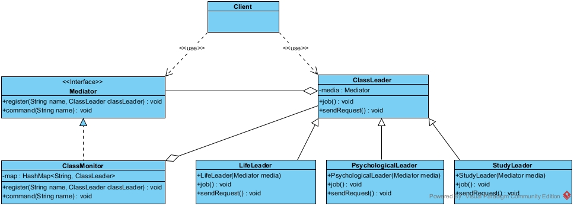


客户端Client类：

```java
/**
 * 使用中介者模式的客户端
 */
public class Client {

    public static void main(String[] args) {
        Mediator m = new ClassMonitor();
        ClassLeader life = new LifeLeader(m);
        ClassLeader study = new StudyLeader(m);
        ClassLeader psycho = new PsychologicalLeader(m);
        //当前委员发送请求给班长然后通过班长与其他委员通信
        System.out.println("------生活委员->班长->心理委员------");
        life.sendRequest();
        System.out.println("--------------------------");

        System.out.println("------学习委员->班长->心理委员,生活委员------");
        study.sendRequest();
        System.out.println("--------------------------");

        System.out.println("------心理委员->班长->生活委员------");
        psycho.sendRequest();
    }
}
```


中介者Mediator接口类

```java
/**
 * 中介者接口类（抽象中介者）
 */
public interface Mediator {

    /**
     * 注册班委员
     */
    void register(String name, ClassLeader classLeader);

    /**
     * 班长根据班委员名字获得通知请求
     */
    void command(String name);
}
```


班长ClassMonitor类：

```java
/**
 * 班长（具体中介者角色）
 */
public class ClassMonitor implements Mediator {

    //利用map集合存放学委的相关属性
    private Map<String, ClassLeader> map = new HashMap<>();

    /**
     * 将对应名称的学委对象进行注册
     */
    @Override
    public void register(String name, ClassLeader classLeader) {
        map.put(name, classLeader);
    }

    /**
     * 班长大人获取来自指定学委的请求通知
     */
    @Override
    public void command(String name) {
        map.get(name).job();
    }
}
```


班委员ClassLeader抽象类：

```java
/**
 * 班委员接口（抽象同事类）
 */
public abstract class ClassLeader {

    //持有对中介者的引用
    protected Mediator media;

    /**
     * 本职工作
     */
    public abstract void job();

    /**
     * 向班长提出请求
     */
    public abstract void sendRequest();
}
```


生活委员LifeLeader类：

```java
/**
 * 生活委员类（具体同事类）
 */
public class LifeLeader extends ClassLeader {

    public LifeLeader(Mediator media) {
        super.media = media;
        media.register("LifeLeader", this);
    }

    @Override
    public void job() {
        System.out.println("生活委员->小张最近生活作风有点问题，需要我的帮助!");
    }

    @Override
    public void sendRequest() {
        System.out.println("生活委员->小张是不是有什么精神负担，班长大人去叫心理委员去看看什么情况吧!");
        media.command("PsychologicalLeader");
    }
}
```


心理委员PsychologicalLeader类：

```java
/**
 * 心理委员
 */
public class PsychologicalLeader extends ClassLeader {

    public PsychologicalLeader(Mediator media) {
        super.media = media;
        media.register("PsychologicalLeader", this);
    }

    @Override
    public void job() {
        System.out.println("心理委员->小张最近心情好像不太好，需要我的帮助!");
    }

    @Override
    public void sendRequest() {
        System.out.println("心理委员->小张是不是生活上有什么问题，班长大人叫生活委员多关注一下吧!");
        media.command("LifeLeader");
    }
}
```


学习委员StudyLeader类：

```java
/**
 * 学习委员
 */
public class StudyLeader extends ClassLeader {

    public StudyLeader(Mediator media) {
        super.media = media;
        media.register("StudyLeader", this);
    }

    @Override
    public void job() {
        System.out.println("学习委员->小张最近成绩突飞猛进，果然在我的英明指导下没有人能不起飞!");
    }

    @Override
    public void sendRequest() {
        System.out.println("学习委员->小张为了成绩居然还搞抄袭，怎么变成这样了?班长大人快去通知生活委员和心理委员看看!");
        media.command("LifeLeader");
        media.command("PsychologicalLeader");
    }
}

```

总结：

1.类之间各司其职，符合迪米特法则。

2.降低了对象之间的耦合性，使得对象易于独立地被复用。

3.将对象间的一对多关联转变为一对一的关联，提高系统的灵活性，使得系统易于维护和扩展。

4.将原本多个对象直接的相互依赖变成了中介者和多个同事类的依赖关系。当同事类越多时，中介者就会越臃肿，变得复杂且难以维护。


典型运用场景举例：
聊天系统中的网络通信，大部分就是采用的中介者模式。
消息队列中间件就是中介者模式最好的例子之一。


## 5.8迭代器模式

迭代器模式提供一个对象来顺序访问聚合对象中的一系列数据，而不暴露聚合对象的内部表示。


进一步阐述：

迭代器模式在客户访问类与聚合类之间插入一个迭代器，这分离了聚合对象与其遍历行为，对客户也隐藏了其内部细节，且满足“单一职责原则”和“开闭原则”，如 Java 中的 Collection、List、Set、Map 等都包含了迭代器。


迭代器模式主要包含四种角色：

Aggregate（抽象聚合角色）：定义存储、添加、删除聚合对象以及创建迭代器对象的接口。

ConcreteAggregate（具体聚合角色）：实现抽象聚合类，返回一个具体迭代器的实例。

Iterator（抽象迭代器角色）：定义访问和遍历聚合元素的接口，通常包含 hasNext()、first()、next() 等方法。

Concretelterator（具体迭代器角色）：实现抽象迭代器接口中所定义的方法，完成对聚合对象的遍历，记录遍历的当前位置。


案例：以自己写一个聚合类来存储数据为例，我们通过迭代器遍历来获取聚合类当中的数据，屏蔽了内部细节，也保证了数据的安全。其中聚合Aggregate抽象类就是抽象聚合角色，具体聚合ConcreteAggregate实现类就是具体聚合角色，迭代器Iterator接口就是抽象迭代器角色，迭代器ConcreteIterator实现类就是具体迭代器角色。


UML类图：

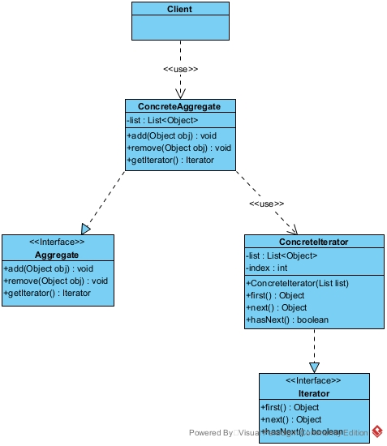


客户端Client类：

```java
/**
 * 使用迭代器模式的客户端类
 */
public class Client {

    public static void main(String[] args) {
        Aggregate ag = new ConcreteAggregate();
        ag.add("中山大学");
        ag.add("华南理工");
        ag.add("韶关学院");
        System.out.println("聚合的内容有：");
        Iterator it = ag.getIterator();
        while (it.hasNext()) {
            Object ob = it.next();
            System.out.println(ob.toString());
        }
        Object ob = it.first();
        System.out.println("First：" + ob.toString());
    }
}
```

 

聚合Aggregate抽象类：

```java
/**
 * 聚合抽象类（聚合抽象）
 */
public interface Aggregate {

    /**
     * 添加元素
     */
    void add(Object obj);

    /**
     * 删除元素
     */
    void remove(Object obj);

    /**
     * 获取迭代器
     */
    Iterator getIterator();
}
```


具体聚合ConcreteAggregate实现类：

```java
/**
 * 具体聚合实现类，内部封装一个集合来作为数据的聚合（具体聚合）
 */
public class ConcreteAggregate implements Aggregate {

    //持有一个集合
    private List<Object> list = new ArrayList<>();

    public void add(Object obj) {
        list.add(obj);
    }

    public void remove(Object obj) {
        list.remove(obj);
    }

    public Iterator getIterator() {
        return (new ConcreteIterator(list));
    }
}
```


迭代器Iterator接口：

```java
/**
 * 迭代器接口（抽象迭代器）
 */
public interface Iterator {

    /**
     * 获取第一个元素
     */
    Object first();

    /**
     * 获取下一个元素
     */
    Object next();

    /**
     * 判断是否有下一个元素
     */
    boolean hasNext();
}
```


迭代器ConcreteIterator实现类：

```java
/**
 * 迭代器实现类（具体迭代器）
 */
public class ConcreteIterator implements Iterator {

    //需要迭代的集合
    private List<Object> list;

    //当前索引下标
    private int index = -1;

    public ConcreteIterator(List<Object> list) {
        this.list = list;
    }

    public boolean hasNext() {
        if (index < list.size() - 1) {
            return true;
        } else {
            return false;
        }
    }

    public Object first() {
        return list.get(0);
    }

    public Object next() {
        Object obj = null;
        if (this.hasNext()) {
            obj = list.get(++index);
        }
        return obj;
    }
}
```

总结：

1.访问一个聚合对象的内容而无须暴露它的内部表示。遍历任务交由迭代器完成，这简化了聚合类。

2.它支持以不同方式遍历一个聚合，甚至可以自定义迭代器的子类以支持新的遍历。

3.增加新的聚合类和迭代器类都很方便，无须修改原有代码。

4.封装性良好，为遍历不同的聚合结构提供一个统一的接口。

5.增加了类的个数，这在一定程度上增加了系统的复杂性。


典型运用场景举例：

由于聚合与迭代器的关系非常密切，所以大多数语言在实现聚合类时都提供了迭代器类，因此大数情况下使用语言中已有的聚合类的迭代器就已经够了，Java中List、Set、HashMap等都有对应的迭代器。


## 5.9访问者模式

访问者模式是指将作用于某种数据结构中的各元素的操作分离出来封装成独立的类，使其在不改变数据结构的前提下可以添加作用于这些元素的新的操作，为数据结构中的每个元素提供多种访问方式。它将对数据的操作与数据结构进行分离，是行为类模式中最复杂的一种模式。


进一步阐述：

在现实生活中，有些集合对象存在多种不同的元素，且每种元素也存在多种不同的访问者和处理方式。例如，公园中存在多个景点，也存在多个游客，不同的游客对同一个景点的评价可能不同；医院医生开的处方单中包含多种药元素，査看它的划价员和药房工作人员对它的处理方式也不同，划价员根据处方单上面的药品名和数量进行划价，药房工作人员根据处方单的内容进行抓药。


访问者模式包含五种角色：

Visitor（抽象访问者角色）：定义一个访问具体元素的接口，为每个具体元素类对应一个访问操作 visit() ，该操作中的参数类型标识了被访问的具体元素。

ConcreteVisitor（具体访问者角色）：实现抽象访问者角色中声明的各个访问操作，确定访问者访问一个元素时该做什么。

Element（抽象元素角色）：声明一个包含接受操作 accept() 的接口，被接受的访问者对象作为 accept() 方法的参数。

ConcreteElement（具体元素角色）：实现抽象元素角色提供的 accept() 操作，其方法体通常都是 visitor.visit(this) ，另外具体元素中可能还包含本身业务逻辑的相关操作。

Object Structure（对象结构角色）：是一个包含元素角色的容器，提供让访问者对象遍历容器中的所有元素的方法，通常由 List、Set、Map 等聚合类实现。


案例：财务都是有账本的，这个账本就可以作为一个对象结构，而它其中的元素有两种，收入和支出，这满足我们访问者模式的要求，即元素的个数是稳定的，因为账本中的元素只能是收入和支出，而查看账本的人可能有这样几种，比如老板，会计事务所的注会，财务主管，等等。而这些人在看账本的时候显然目的和行为是不同的。其中账单Bill接口就是抽象元素角色，消费的账单ConsumeBill类和收入的账单IncomeBill类就是具体的元素角色，账单访问者AccountBookViewer接口就是抽象访问者角色，老板Boss类和会计师CPA类就是具体访问者角色，账本AccountBook类就是对象结构角色。


UML类图：

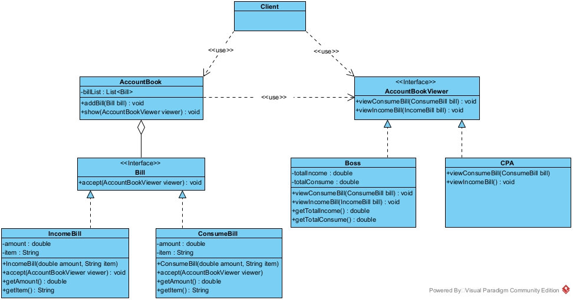


客户端Client类：

```java
/**
 * 使用访问者模式的客户端
 */
public class Client {

    public static void main(String[] args) {
        AccountBook accountBook = new AccountBook();
        //添加两条收入
        accountBook.addBill(new IncomeBill(10000, "卖商品"));
        accountBook.addBill(new IncomeBill(12000, "卖广告位"));
        //添加两条支出
        accountBook.addBill(new ConsumeBill(1000, "工资"));
        accountBook.addBill(new ConsumeBill(2000, "材料费"));

        AccountBookViewer boss = new Boss();
        AccountBookViewer cpa = new CPA();

        //两个访问者分别访问账本
        accountBook.show(cpa);
        accountBook.show(boss);

        ((Boss) boss).getTotalConsume();
        ((Boss) boss).getTotalIncome();
    }
}
```


账单Bill接口：

```java
/**
 * 账单接口（抽象元素角色）
 */
public interface Bill {

    /**
     * 对账单进行访问
     * @param viewer 访问者对象
     */
    void accept(AccountBookViewer viewer);
}
```


消费的账单ConsumeBill类：

```java
/**
 * 消费的账单（具体元素角色）
 */
public class ConsumeBill implements Bill {

    //金额
    private double amount;

    //消费的事项
    private String item;

    public ConsumeBill(double amount, String item) {
        this.amount = amount;
        this.item = item;
    }

    public void accept(AccountBookViewer viewer) {
        viewer.viewConsumeBill(this);
    }

    public double getAmount() {
        return amount;
    }

    public String getItem() {
        return item;
    }
}
```


收入的账单IncomeBill类：

```java
/**
 * 收入账单（具体元素角色）
 */
public class IncomeBill implements Bill {

    //金额
    private double amount;

    //收入的事项
    private String item;

    public IncomeBill(double amount, String item) {
        this.amount = amount;
        this.item = item;
    }

    public void accept(AccountBookViewer viewer) {
        viewer.viewIncomeBill(this);
    }

    public double getAmount() {
        return amount;
    }

    public String getItem() {
        return item;
    }
}
```


账单访问者AccountBookViewer接口：

```java
/**
 * 账单访问者接口（抽象访问者角色）
 */
public interface AccountBookViewer {

    /**
     * 查看消费的账单
     */
    void viewConsumeBill(ConsumeBill bill);

    /**
     * 查看收入的账单
     */
    void viewIncomeBill(IncomeBill bill);
}
```


老板Boss类：

```java
/**
 * 老板类（具体访问者角色）
 * 老板只关注一共花了多少钱以及一共收入多少钱，其余并不关心
 */
public class Boss implements AccountBookViewer{

    //总共收入的金额
    private double totalIncome;

    //总共消费的金额
    private double totalConsume;

    @Override
    public void viewConsumeBill(ConsumeBill bill) {
        totalConsume += bill.getAmount();
    }

    @Override
    public void viewIncomeBill(IncomeBill bill) {
        totalIncome += bill.getAmount();
    }

    public double getTotalIncome() {
        System.out.println("老板查看一共收入多少，数目是：" + totalIncome);
        return totalIncome;
    }

    public double getTotalConsume() {
        System.out.println("老板查看一共花费多少，数目是：" + totalConsume);
        return totalConsume;
    }
}
```


会计师CPA类：

```java
/**
 * 会计师类（具体访问者角色）
 */
public class CPA implements AccountBookViewer {

    /**
     * 会计师在看账本时，如果是支出并且是工资，则需要看应该交的税交了没
     */
    @Override
    public void viewConsumeBill(ConsumeBill bill) {
        if (bill.getItem().equals("工资")) {
            System.out.println("会计师查看工资是否交个人所得税。");
        }
    }

    /**
     * 如果是收入，则所有的收入都要交税
     */
    @Override
    public void viewIncomeBill(IncomeBill bill) {
        System.out.println("会计师查看收入交税了没。");
    }
}
```


账本AccountBook类：

```java
/**
 * 账本类（对象结构角色）
 */
public class AccountBook {

    //单子列表
    private List<Bill> billList = new ArrayList<>();

    //添加单子
    public void addBill(Bill bill) {
        billList.add(bill);
    }

    //供账本的查看者查看账本
    public void show(AccountBookViewer viewer) {
        for (Bill bill : billList) {
            bill.accept(viewer);
        }
    }
}
```

总结：

1.扩展性好。能够在不修改对象结构中的元素的情况下，为对象结构中的元素添加新的功能。

2.复用性好。可以通过访问者来定义整个对象结构通用的功能，从而提高系统的复用程度。

3.灵活性好。访问者模式将数据结构与作用于结构上的操作解耦，使得操作集合可相对自由地演化而不影响系统的数据结构。

4.符合单一职责原则。访问者模式把相关的行为封装在一起，构成一个访问者，使每一个访问者的功能都比较单一。

5.增加新的元素类很困难。在访问者模式中，每增加一个新的元素类，都要在每一个具体访问者类中增加相应的具体操作，这违背了开闭原则。

6.破坏封装。访问者模式中具体元素对访问者公布细节，这破坏了对象的封装性。

7.违反了依赖倒置原则。访问者模式依赖了具体类，而没有依赖抽象类。


典型运用场景举例：

访问者是一种集中规整模式,特别适合用于大规模重构的项目，在这一个阶段的需求已经非常清晰，原系统的功能点也已经明确，通过访问者模式可以很容易把一些功能进行梳理，达到最终目的功能集中化。简而言之，就是当对集合中的不同类型数据（类型数量稳定）进行多种操作时，使用访问者模式。


## 5.10备忘录模式

备忘录模式是指在不破坏封装性的前提下，捕获一个对象的内部状态，并在该对象之外保存这个状态，以便以后当需要时能将该对象恢复到原先保存的状态。该模式又叫快照模式。


进一步阐述：

备忘录模式能记录一个对象的内部状态，当用户后悔时能撤销当前操作，使数据恢复到它原先的状态。


备忘录模式有三种角色：

Originator（发起人角色）：记录当前时刻的内部状态信息，提供创建备忘录和恢复备忘录数据的功能，实现其他业务功能，它可以访问备忘录里的所有信息。

Memento（备忘录角色）：负责存储发起人的内部状态，在需要的时候提供这些内部状态给发起人。

Caretaker（管理者角色）：对备忘录进行管理，提供保存与获取备忘录的功能，但其不能对备忘录的内容进行访问与修改。


案例：我们用一个游戏来举例，在玩一个步骤游戏时，每走一步时步数都加一，遇到道具可以快速走几步，或者减几步，踩到屎了就游戏结束，但是可以读档到之前的一步。其中游戏Game类就是发起人角色，备份GameMemento类就是备忘录角色，备份信息管理GameMemento类就是管理者角色。


UML类图：

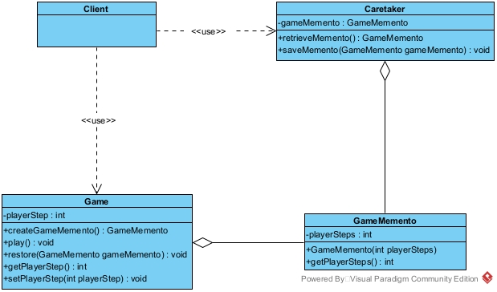


客户端Client类：

```java
/**
 * 使用备忘录模式的客户端
 */
public class Client {

    public static void main(String[] args) {
        Game game = new Game();
        System.out.println("游戏开始");
        game.play();

        System.out.println("捡到滑板，前进10步");
        game.setPlayerStep(10);

        System.out.println("存个档，创建存档");
        GameMemento gameMemento = game.createGameMemento();

        System.out.println("把存档交给存档器管理");
        Caretaker caretaker = new Caretaker();
        caretaker.saveMemento(gameMemento);
        System.out.println("存档完毕");

        System.out.println("继续前进1步");
        game.setPlayerStep(game.getPlayerStep() + 1);
        System.out.println("踩到屎了，当前步数为：" + game.getPlayerStep());

        System.out.println("读档，还原到之前一步");
        game.restore(caretaker.retrieveMemento());
        System.out.println("读档完毕，当前玩家步数是：" + game.getPlayerStep());
    }
}
```


游戏Game类：

```java
/**
 * 游戏类（发起人角色）
 */
public class Game {

    //玩家走的步数
    private int playerStep;

    /**
     * 备份游戏
     */
    public GameMemento createGameMemento() {
        return new GameMemento(playerStep);
    }

    /**
     * 开始玩游戏
     */
    public void play() {
        playerStep = 0;
    }

    /**
     * 恢复备份
     */
    public void restore(GameMemento gameMemento) {
        this.playerStep = gameMemento.getPlayerSteps();
    }

    public int getPlayerStep() {
        return playerStep;
    }

    public void setPlayerStep(int playerStep) {
        this.playerStep = playerStep;
    }
}
```


备份GameMemento类：

```java
/**
 * 备份（备忘录角色）
 */
public class GameMemento {

    //步数
    private int playerSteps;

    /**
     * 备份步数
     */
    public GameMemento(int playerSteps) {
        this.playerSteps = playerSteps;
    }

    public int getPlayerSteps() {
        return playerSteps;
    }
}
```


备份信息管理GameMemento类：

```java
/**
 * 备份信息管理类（管理者角色）
 */
public class Caretaker {

    //备份
    private GameMemento gameMemento;

    /**
     * 恢复备份
     */
    public GameMemento retrieveMemento() {
        return this.gameMemento;
    }

    /**
     * 保存备份
     */
    public void saveMemento(GameMemento gameMemento) {
        this.gameMemento = gameMemento;
    }
}
```

总结：

1.提供了一种可以恢复状态的机制。当用户需要时能够比较方便地将数据恢复到某个历史的状态。

2.实现了内部状态的封装。除了创建它的发起人之外，其他对象都不能够访问这些状态信息。

3.简化了发起人类，发起人不需要管理和保存其内部状态的各个备份，所有状态信息都保存在备忘录中，并由管理者进行管理，这符合单一职责原则。

4.资源消耗大，如果要保存的内部状态信息过多或者特别频繁，将会占用比较大的内存资源。


典型运用场景举例：

需要保存与恢复数据的场景，如玩游戏时的中间结果的存档功能。

需要提供一个可回滚操作的场景，如 Word、记事本、Photoshop，Eclipse 等软件在编辑时按 Ctrl+Z 组合键，还有数据库中事务操作。


## 5.11解释器模式

解释器模式是指给分析对象定义一个语言，并定义该语言的文法表示，再设计一个解析器来解释语言中的句子。也就是说，用编译语言的方式来分析应用中的实例。这种模式实现了文法表达式处理的接口，该接口解释一个特定的上下文。


进一步阐述：

在软件开发中，会遇到有些问题多次重复出现，而且有一定的相似性和规律性。如果将它们归纳成一种简单的语言，那么这些问题实例将是该语言的一些句子，这样就可以用“编译原理”中的解释器模式来实现了。


解释器模式包含五种角色：

Abstract Expression（抽象表达式角色）：定义解释器的接口，约定解释器的解释操作，主要包含解释方法 interpret()。

Terminal Expression（终结符表达式角色）：是抽象表达式的子类，用来实现文法中与终结符相关的操作，文法中的每一个终结符都有一个具体终结表达式与之相对应。

Nonterminal Expression（非终结符表达式角色）：也是抽象表达式的子类，用来实现文法中与非终结符相关的操作，文法中的每条规则都对应于一个非终结符表达式。

Context（环境角色）：通常包含各个解释器需要的数据或是公共的功能，一般用来传递被所有解释器共享的数据，后面的解释器可以从这里获取这些值。

Client（客户端）：主要任务是将需要分析的句子或表达式转换成使用解释器对象描述的抽象语法树，然后调用解释器的解释方法，当然也可以通过环境角色间接访问解释器的解释方法。


案例：用解释器模式设计一个“天府通”公交车卡的读卡器程序。其中抽象表达式Expression接口就是抽象表达式角色，解释器终结符表达TerminalExpression类就是终结符表达式角色，解释器非终结符表达AndExpression类就是非终结符表达式角色，环境Context类就是环境角色，客户端Client类就是客户端。


UML类图：

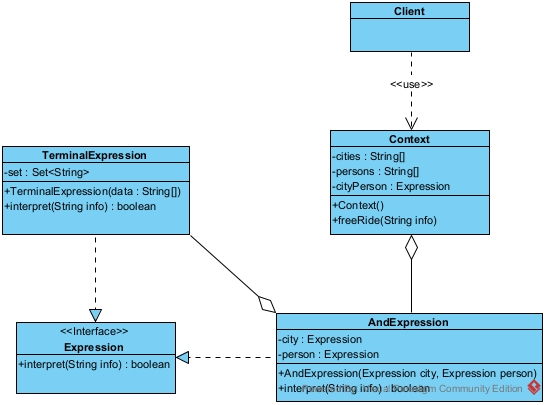


客户端Client类：

```java
/**
 * 使用解释器模式的客户端
 */
public class Client {

    public static void main(String[] args) {
        Context bus = new Context();
        bus.freeRide("成都的老人");
        bus.freeRide("成都的年轻人");
        bus.freeRide("广州的妇女");
        bus.freeRide("广州的儿童");
        bus.freeRide("北京的儿童");
    }
}
```


抽象表达式Expression接口：

```java
/**
 * 抽象表达式类
 */
public interface Expression {

    /**
     * 解释方法
     */
    boolean interpret(String info);
}
```


解释器终结符表达TerminalExpression类：

```java
/**
 * 解释器终结符表达类
 */
public class TerminalExpression implements Expression {

    private Set<String> set = new HashSet<>();

    public TerminalExpression(String[] data) {
        set.addAll(Arrays.asList(data));
    }

    public boolean interpret(String info) {
        return set.contains(info);
    }
}
```


解释器非终结符表达AndExpression类：

```java
/**
 * 解释器非终结符表达类
 */
public class AndExpression implements Expression {

    //地市
    private Expression city;

    //人群
    private Expression person;

    public AndExpression(Expression city, Expression person) {
        this.city = city;
        this.person = person;
    }

    public boolean interpret(String info) {
        String[] s = info.split("的");
        return city.interpret(s[0]) && person.interpret(s[1]);
    }
}
```


环境Context类：

```java
/**
 * 环境类
 */
public class Context {

    //定义免费解析的城市
    private String[] cities = {"成都", "广州"};

    //定义解析的人群
    private String[] persons = {"老人", "妇女", "儿童"};

    private Expression cityPerson;

    public Context() {
        Expression city = new TerminalExpression(cities);
        Expression person = new TerminalExpression(persons);
        cityPerson = new AndExpression(city, person);
    }

    public void freeRide(String info) {
        boolean ok = cityPerson.interpret(info);
        if (ok) {
            System.out.println("您是" + info + "，您本次乘车免费！");
        } else {
            System.out.println(info + "，您不是免费人员，本次乘车扣费2元！");
        }
    }
}
```

总结：

1.扩展性好。由于在解释器模式中使用类来表示语言的文法规则，因此可以通过继承等机制来改变或扩展文法。

2.容易实现。在语法树中的每个表达式节点类都是相似的，所以实现其文法较为容易。

3.执行效率较低。解释器模式中通常使用大量的循环和递归调用，当要解释的句子较复杂时，其运行速度很慢，且代码的调试过程也比较麻烦。

4.会引起类膨胀。解释器模式中的每条规则至少需要定义一个类，当包含的文法规则很多时，类的个数将急剧增加，导致系统难以管理与维护。

5.可应用的场景比较少。在软件开发中，需要定义语言文法的应用实例非常少，所以这种模式很少被使用到。


典型运用场景举例：
当一个语言需要解释执行，并且语言中的句子可以表示为一个抽象语法树的时候，如 XML 文档解释。解释器模式在实际的软件开发中使用比较少，因为它会引起效率、性能以及维护等问题。如果碰到对表达式的解释，在 Java中可以用 Expression4J 或 Jep 等来设计。


# 6.设计模式总结

创建型：

单例模式：一个类在内存中只有一个实例，节约内存，减小系统占用资源。

简单工厂模式：将实现了某一接口的类的对象的创建过程和使用方解耦。

工厂方法模式：将创建实现了某一接口的类的对象的过程设计为一个抽象方法，将其创建过程下沉到子类去实现，提高了工厂的可扩展性。

抽象工厂模式：将创建实现了多个接口的各自的实现类的对象的创建过程封装起来成为多个抽象方法，可以创建一个产品簇。

建造者模式：将复杂对象的组成零件和整个对象的创建过程进行了分离，零件的创建由Builder来负责单独构造，由Director负责单独组装，从而可以构造出复杂的对象。

原型模式：用一个已经创建的实例作为原型，通过复制该原型对象来创建一个和原型相同或相似的新对象，提高对象的创建效率。


结构型：

适配器模式：使原本由于接口不兼容导致的不能一起工作的类（实现了不同接口的类）可以一起协同工作。

装饰者模式：使用组合的方式代替继承去动态地给一个对象添加额外的功能。

门面模式：为子系统提供统一的调用方法，使得调用者不用去和所有相关的子系统打交道，主要遵循迪米特法则。

桥接模式：处理具有多维度变化的多重继承结构，分离抽象部分和实现部分，将各个维度设计成独立的继承和实现结构，使各个维度可以独立的扩展，并在抽象层建立关联。

代理模式：代理对象可以扩展目标对象的功能。代理模式能将客户端与目标对象分离，在一定程度上降低了系统的耦合度，增加了程序的可扩展性。

享元模式：它通过共享已经存在的对象来大幅度减少需要创建的对象数量、避免大量相似类的开销，从而提高系统资源的利用率。

组合模式：使得客户端代码可以一致地处理单个对象和组合对象，无须关心自己处理的是单个对象，还是组合对象，这简化了客户端代码。


行为型：

策略模式：定义一系列算法，并将每个算法封装在一个类中，在使用时可以相互替换，具体使用什么策略交由调用者决定。

模板方法模式：定义一个具有固定操作的算法骨架，将某些易变的步骤延迟到子类中实现，提高代码的可复用性。

观察者模式：当一个对象状态发生改变时，通知其相关依赖对象让它们去自动更新因为被观察的对象状态改变而发生的改变。

责任链模式：解决请求发送者和接收者的强耦合关系，让多个对象都有可能接收请求，将这些对象连成一条链，并且沿着这条链传递请求，直到有对象处理为止。

委派模式：将一个处理逻辑封装成任务，自己不直接去处理，而是委托他人去处理，自己负责最后结果的上报。

状态模式：对有状态的对象，把复杂的“判断逻辑”提取到不同的状态对象中，允许状态对象在其内部状态发生改变时改变其行为。

中介者模式：定义一个中介对象来封装一系列对象之间的交互，使原有对象之间的耦合松散，且可以独立地改变它们之间的交互。

迭代器模式：提供一个对象来顺序访问聚合对象中的一系列数据，而不暴露聚合对象的内部表示。

访问者模式：将作用于某种数据结构中的各元素的操作分离出来封装成独立的类，使其在不改变数据结构的前提下可以添加作用于这些元素的新的操作，为数据结构中的每个元素提供多种访问方式。

备忘录模式：不破坏封装性的前提下，捕获一个对象的内部状态，并在该对象之外保存这个状态，这样以后就可以将该对象恢复到原先保存的状态。

解释器模式：指给分析对象定义一个语言，并定义该语言的文法表示，再设计一个解析器来解释语言中的句子。
